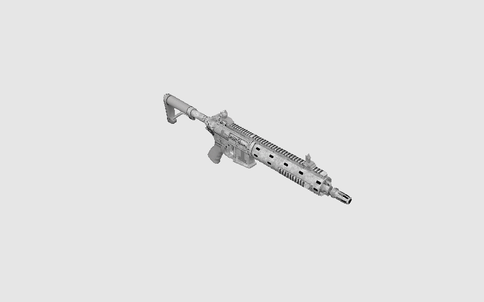
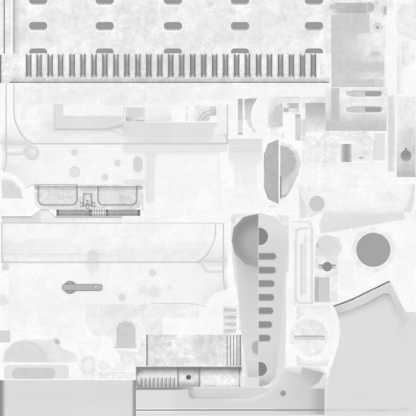
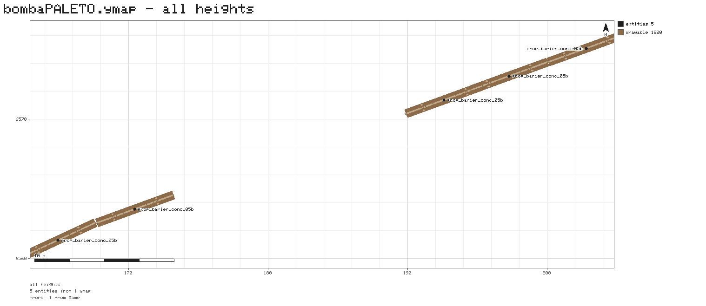
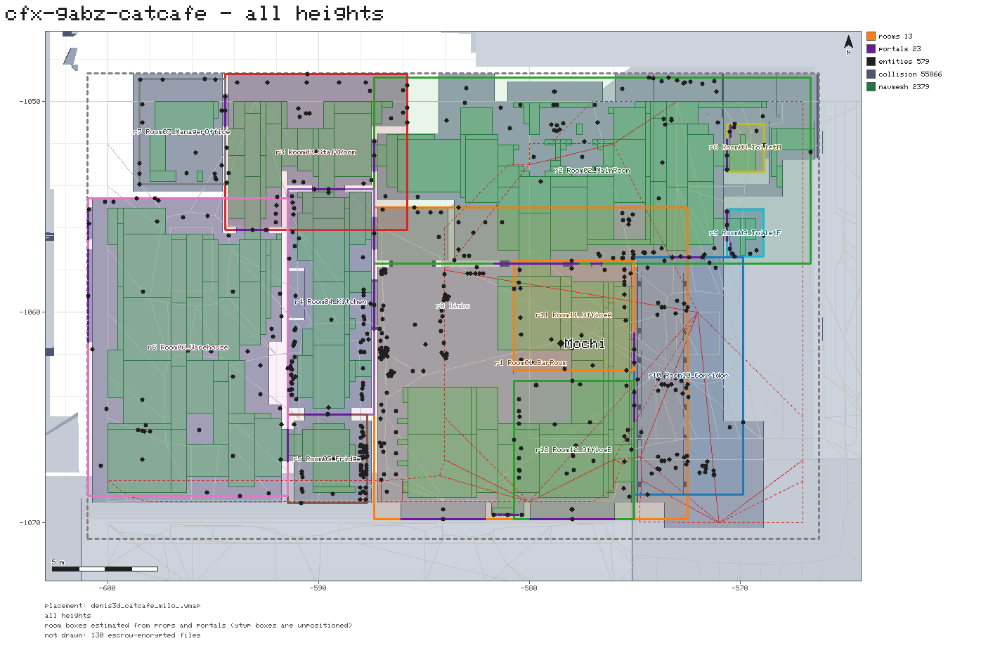
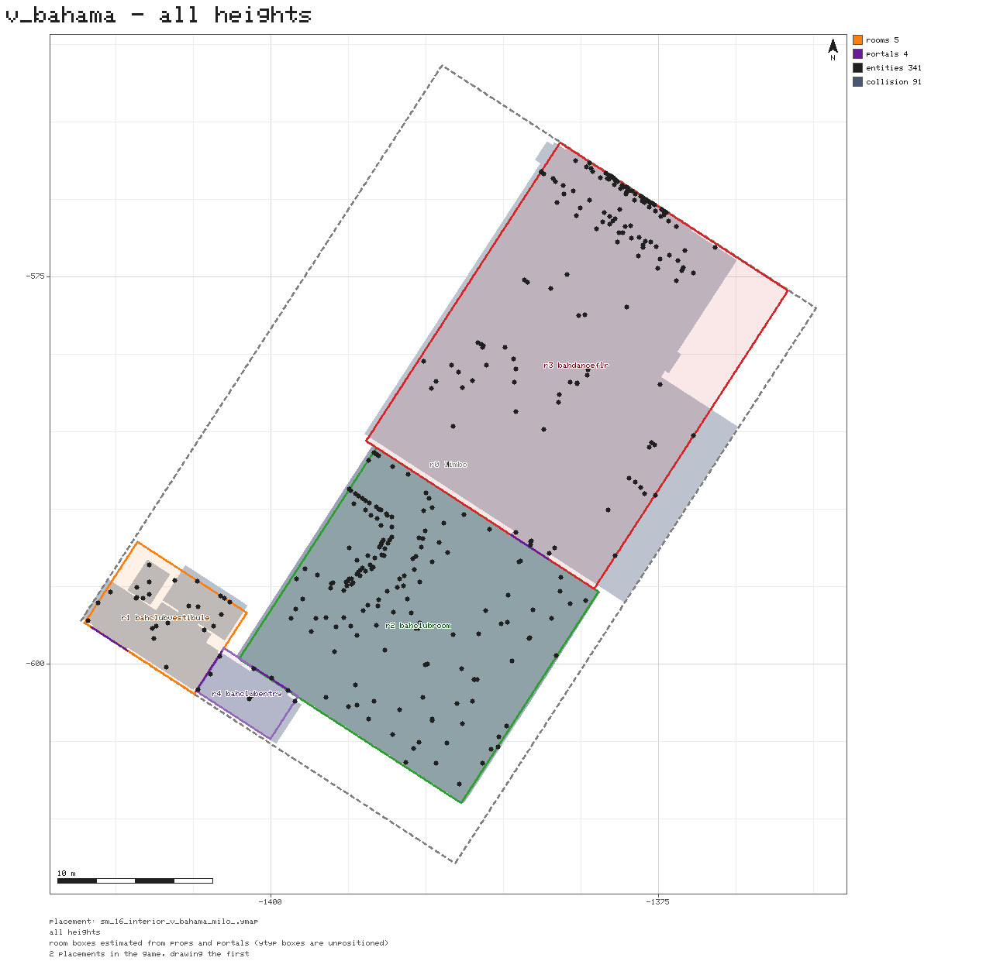
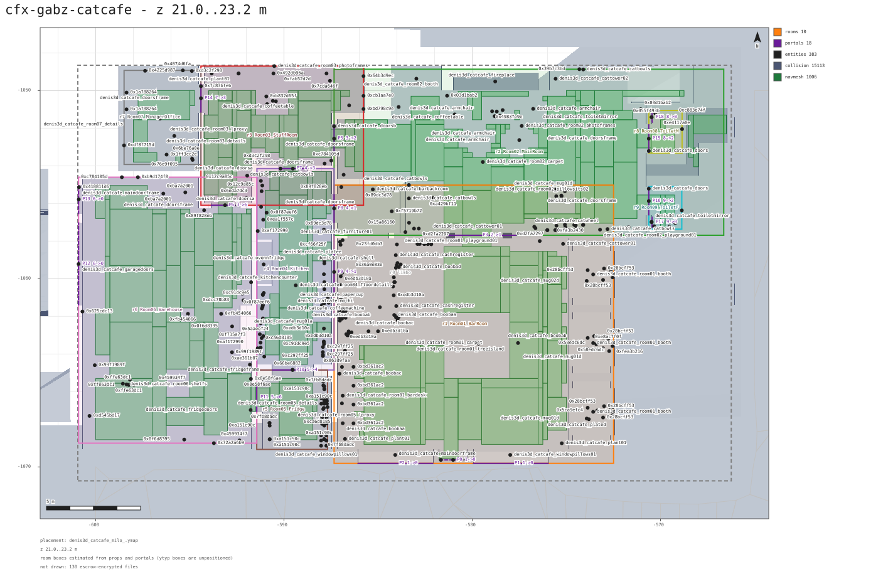
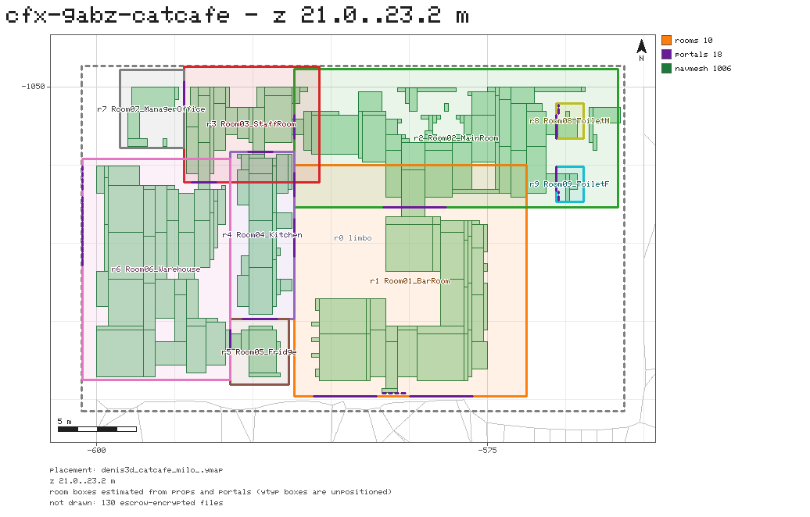

# rage-cli

A command-line tool for GTA V game files, written in Rust. It opens RPF
archives (including the encrypted retail ones, given your own game install),
finds files across nested archives without extracting them, inspects and
exports the resources inside, renders models to pictures, and reads and
writes navmeshes. No CodeWalker, no GPU, no game running.


The binary is `rage`. It was called `rpf` until 0.16; see [Upgrading from
rpf-cli](#upgrading-from-rpf-cli).

## Contents

- [The toolchain](#the-toolchain)
- [Install](#install)
- [Quick start](#quick-start)
- [Concepts](#concepts)
- [Commands](#commands)
- [Samples](#samples)
- [Recipes](#recipes)
- [Configuration](#configuration)
- [Architecture](#architecture)
- [Releasing](#releasing)
- [Upgrading from rpf-cli](#upgrading-from-rpf-cli)
- [Acknowledgements](#acknowledgements)

## The toolchain

`rage` is thin: dispatch, argument parsing and the odd workflow. Everything
that understands a file format lives in three library crates, which anyone
can use on their own.

```
                 +-----------------------------------------------+
                 |  rage-cli   (this repo, binary `rage`)         |
                 |  commands, texture index, navmesh generator    |
                 +-------+------------------+-------------------+-+
                         |                  |                   |
       +-----------------v---+   +----------v-----------+   +---v----------------+
       | rpf-archive         |   | rage-formats         |   | rage-render        |
       | RPF0..RPF8 and IMG  |   | RSC7 resources:      |   | CPU rasteriser,    |
       | archives, NG/AES    |   | ytd ydr ydd yft ymt  |   | contact sheets,    |
       | keys, RPF writer,   |   | ytyp ymap ybn ynv,   |   | bitmap font,       |
       | DLC load order      |   | RSC7 writer          |   | wasm glTF export   |
       +---------------------+   +----------+-----------+   +--------------------+
                                            ^                        |
                                            +------------------------+
```

| Crate | Repo | Owns |
|---|---|---|
| `rpf-archive` | [VIRUXE/rpf-archive-rs](https://github.com/VIRUXE/rpf-archive-rs) | getting bytes in and out of `.rpf`/`.img` archives |
| `rage-formats` | [VIRUXE/rage-formats](https://github.com/VIRUXE/rage-formats) | turning those bytes into structs, and structs back into bytes |
| `rage-render` | [VIRUXE/rage-render](https://github.com/VIRUXE/rage-render) | drawing what `rage-formats` parsed |
| `rage-cli` | this repo | the commands people run |

A sibling project, [fivem-mcp](https://github.com/VIRUXE/fivem-mcp), drives a
running FiveM client from an AI agent; it is how the navmesh work below gets
verified in game.

## Install

Prebuilt Windows and Linux binaries are attached to every
[release](https://github.com/VIRUXE/rage-cli/releases). Or build from source:

```sh
cargo install --git https://github.com/VIRUXE/rage-cli
```

Already installed? `rage update install` replaces the binary in place with
the latest release; see [Updating](#updating).

Reading retail game archives needs keys from your own game install; see
[Keys](#keys). Unencrypted archives, such as FiveM resource packs, need no
setup at all.

## Quick start

Point the tool at the game once, then look around:

```sh
export GTAV_PATH="C:/Program Files (x86)/Steam/steamapps/common/Grand Theft Auto V"

rage search "$GTAV_PATH" "prop_cs_heist_bag*" -d       # where is it, across every archive
rage extract "$GTAV_PATH/x64c.rpf" "*/lev_des.rpf" -o ./nested
rage screenshot ./nested/levels/gta5/props/lev_des/lev_des.rpf prop_cs_heist_bag_01.ydr --views front,iso --grid
```

Three commands, one picture. The rest of this document is variations on that.

## Concepts

**Archives.** GTA V keeps its files in `.rpf` archives, and archives inside
archives: `x64c.rpf` holds `levels/gta5/props/lev_des/lev_des.rpf`, which
holds the props. `list` and `tree` see one archive's top level; `search`
descends through nesting in memory; `extract` writes nested archives out as
files so the other commands can open them. Retail archives are NG-encrypted;
FiveM resource archives usually are not.

**Resources.** Most files inside are RSC7 resources: a 16-byte header, then a
deflated body split into a system section and a graphics section, with
pointers between blocks. Textures (`.ytd`), models (`.ydr`, `.ydd`, `.yft`),
metadata (`.ytyp`, `.ymap`, `.ymt`), collision (`.ybn`) and navmeshes
(`.ynv`) are all RSC7. `resource info` shows the header and what a file holds.

**Metadata.** Map data is self-describing: a `.ymap`, `.ytyp` or `.ymt`
carries the layout of its own structures inside the RSC7 body, and a
`_manifest.ymf` or `.pso` carries the same in the big-endian PSO container
(FiveM also accepts hand-written XML manifests). Names in them are JOAAT
hashes. `resource info` reads the map, type and manifest files by name;
`resource dump` writes any of them out whole as XML or JSON; `names harvest`
builds the hash-to-name list from the game's own files so both print names
rather than `hash_XXXXXXXX`.

**Load order.** The game reads its base archives, then `update.rpf`, then
each DLC pack in the order `dlclist.xml` and the packs' `setup2.xml` decide.
Later wins. Commands that fetch something "from the game" (`index`,
`navmesh cell`) follow that order so they hand you what the game would use.

**Keys.** Retail archives need the AES key from your `GTA5.exe`; the NG keys
and tables are derived from it. `--exe` or `GTAV_PATH` names the executable,
and the result is cached per game build.

**The index.** `screenshot` needs textures a model references but does not
carry. `rage index build` scans every archive once and records which
dictionary holds which texture, which archetype names which dictionary, the
dictionary parent chain, and each archetype's bounding box. Renders and the
navmesh generator read it from `~/.rage-cli/index`.

**Navmesh cells.** Pathfinding runs on `.ynv` files, one per 150 m grid cell,
named `navmesh[X][Y].ynv` with X and Y the cell index times three. Interiors
have no navmesh of their own: their polygons live inside the cell, flagged
interior. A custom interior (MLO) ships none, so NPCs inside it walk on the
polygons of whatever stood there before.

**Escrow.** FiveM asset escrow encrypts some stream files (`FXAP` header).
Those cannot be read by anything but the client; every command says so
rather than guessing.

## Commands

Global options work on every command: `--exe <PATH>` or `GTAV_PATH` for the
keys, `--keys <DIR>` for keys written out with `extract-keys`, `-v` for
debug logging, `--no-update-check` to skip the daily release check.

### Archives

| Command | Does |
|---|---|
| `info <archive>` | version, encryption, entry count, size |
| `list <archive> [pattern] [-d]` | one archive's top level, optionally filtered |
| `tree <archive> [--depth N]` | the same as a tree |
| `search <path> <pattern> \| --content \| --hex \| --hash` | find files by name, contents or JOAAT hash, descending into nested archives; `<path>` may be a directory |
| `extract <archive> [pattern] -o DIR [--recursive]` | write files out; `--recursive` descends into nested archives and gives resources a valid RSC7 header |
| `verify <archive>` | integrity check |
| `create <dir> -o FILE [--version 7] [--encryption none\|open\|ng]` | build an archive from a directory |
| `extract-keys --exe PATH -o DIR` | write the keys to disk for `--keys` |

### Resources and textures

| Command | Does |
|---|---|
| `resource info <file> [--archive RPF] [--json] [--limit N] [--names FILE]...` | header plus a summary: every texture of a `.ytd`; bounds, LODs, geometry and shaders of a drawable; name, flags, extents and entity table of a `.ymap`; archetypes and interiors of a `.ytyp`; dependencies of a `_manifest.ymf` (PSO, RBF or XML) |
| `resource dump <file> [--archive RPF] [--json] [-o FILE] [--names FILE]...` | any Meta or PSO file (`.ymap` `.ytyp` `.ymt` `.ymf` `.pso`) as XML in CodeWalker's layout, or as JSON |
| `names harvest \| info \| lookup <term>...` | the hash-to-name list: build it from the game (`--exe` required), see where it is, or hash a name / name a hash |
| `textures <archive> <file> [-o DIR] [--format png\|jpg\|webp] [--sheet] [--max-size PX] [--dds]` | export a dictionary's textures, or the textures baked into a drawable, as images (alias `ytd`) |

### Rendering

| Command | Does |
|---|---|
| `screenshot <archive> <file> [--views ...] [--grid] [--ytd NAME]... [--paint #rrggbb] [--background ...] [--size WxH] [--lod ...] [--entry ...]` | render a `.ydr`/`.ydd`/`.yft` from up to six fixed angles, textures resolved from the file, `--ytd` and the index |
| `plot <input>... [--ymap\|--ytyp\|--ybn\|--ydr FILE]... [--layers ...] [--floor-z Z\|--z-range LO,HI] [--region ...] [--scale PX] [--marker x,y,label]... [--labels] [--props N\|--no-props] [--title T] [--quality Q] -o FILE` | a top-down plan of an interior — rooms, portals, props, collision, drawable shell and navmesh — or of an exterior map, its entities drawn with their models — as PNG, JPG, WebP or SVG |

### Navmeshes

| Command | Does |
|---|---|
| `navmesh info <file> [--archive RPF]` | cell, bounds, polygon/edge/portal/point counts, adjacent cells |
| `navmesh cell --at X,Y \| --index CX,CY -o FILE` | pull a cell out of the game, from the archive that loads last |
| `navmesh export <ynv> -o OBJ` | polygons as OBJ, grouped exterior/interior/sunk |
| `navmesh ybn-obj <ybn> [--ymap FILE] -o OBJ` | a collision file's triangles as OBJ, placed in the world by the ymap's MLO instance |
| `navmesh build <cell> --ybn FILE... --clip x0,y0,x1,y1 --floor-z Z -o FILE [...]` | generate interior polygons from collision and append them to the cell; see [Building a navmesh for an interior](#building-a-navmesh-for-an-interior) |
| `navmesh rewrite <ynv> -o FILE` | parse and write back unchanged; checks the writer against the game |

### Game index and maintenance

| Command | Does |
|---|---|
| `index build \| info \| clear` | the game-wide texture and archetype index (`--exe` required) |
| `update check \| install` | self-update from GitHub releases |

## Samples

One picture per kind of media `rage` writes, with the command that made it.
The interior is Gabz's cat cafe (a FiveM resource) over the navmesh built
in the recipe below; the props are vanilla.

| Media | Command | Sample |
|---|---|---|
| Interior plan, all layers (PNG) | `plot <resource folder> navmesh[108][96].ynv --marker ...` | [plot-catcafe.png](docs/images/plot-catcafe.png) |
| One storey with labels (SVG) | `plot ... --floor-z 21.25 --labels` | [plot-catcafe-floor.svg](docs/images/plot-catcafe-floor.svg) |
| Rooms, portals and navmesh only (WebP) | `plot ... --floor-z 21.25 --layers rooms,portals,navmesh --scale 20` | [plot-catcafe-rooms.webp](docs/images/plot-catcafe-rooms.webp) |
| Vanilla interior by name (JPEG) | `plot v_bahama --scale 20` | [plot-bahama.jpg](docs/images/plot-bahama.jpg) |
| Model from several angles (JPEG grid) | `screenshot weapons.rpf w_ar_carbinerifle.ydr --views front,top,iso --grid` | [screenshot-carbinerifle-grid.jpg](docs/images/screenshot-carbinerifle-grid.jpg) |
| Model from one angle (WebP) | `screenshot weapons.rpf w_ar_carbinerifle.ydr --views iso --size 800x500 --format webp` | [screenshot-carbinerifle-iso.webp](docs/images/screenshot-carbinerifle-iso.webp) |
| Vehicle with wheels and paint (JPEG grid) | `screenshot vehicles.rpf adder.yft --views front,left,iso --grid --ytd adder --ytd vehshare --paint "#8b1a1a"` | [screenshot-adder-paint-grid.jpg](docs/images/screenshot-adder-paint-grid.jpg) |
| Translucent model on a transparent background (PNG) | `screenshot lev_des_mp_dlc.rpf hei_prop_pill_bag_01.ydr --views front --background transparent` | [screenshot-pill-bag-transparent.png](docs/images/screenshot-pill-bag-transparent.png) |
| One texture (PNG) | `textures weapons.rpf w_ar_carbinerifle.ytd --max-size 512` | [textures-carbinerifle-diffuse.png](docs/images/textures-carbinerifle-diffuse.png) |
| Texture dictionary contact sheet (JPEG) | `textures weapons.rpf w_ar_carbinerifle.ytd --sheet --max-size 256` | [textures-carbinerifle-sheet.jpg](docs/images/textures-carbinerifle-sheet.jpg) |
| Navmesh polygons (OBJ) | `navmesh export navmesh[108][96].ynv` | [navmesh-catcafe.obj](docs/samples/navmesh-catcafe.obj) |
| Placed collision (OBJ) | `navmesh ybn-obj denis3d_catcafe.ybn --ymap denis3d_catcafe_milo_.ymap` | [collision-catcafe.obj](docs/samples/collision-catcafe.obj) |

`screenshot`, `textures` and `plot` all take `--format png|jpg|webp` (`plot`
reads it off the `-o` extension, and adds `svg`); `--json` output and
`extract` are data, not media, so they are not pictured.

## Recipes

### Look inside an archive

```sh
rage info mp_biker_weed.rpf
rage tree mp_biker_weed.rpf
rage list mp_biker_weed.rpf "*bag*"
```

```
RPF Archive Information
======================
Entries:     70 (1 dirs, 69 files)
Encryption:  NG
Total size:  7375256 bytes (7.03 MB)

mp_biker_weed.rpf
├── _manifest.ymf (2.40 KB)
├── bkr_mp_biker_weed.ytyp (4.26 KB)
├── bkr_prop_fertiliser_pallet+hi.ytd (290.52 KB)
├── bkr_prop_fertiliser_pallet.ytd (110.82 KB)
├── bkr_prop_fertiliser_pallet_01a.ydr (134.05 KB)
├── bkr_prop_grow_lamp_02b+hidr.ytd (438.45 KB)
…
```


### Find anything, anywhere

`list` only sees one archive's top level. `search` descends into nested
`.rpf` entries in memory, and takes a directory to cover every archive under
it:

```sh
rage search "<GTA V>/x64c.rpf" "prop_cs_heist_bag*" -d    # which nested rpf holds it, with details
rage search "<GTA V>" "*.ymt" --json                       # every .ymt in the whole install
rage search "<GTA V>/x64a.rpf" --content binoculars -i     # bytes inside files (resources are inflated)
rage search "<GTA V>/x64b.rpf" --hex "52 53 43 37" --limit 5
rage search "<GTA V>/x64a.rpf" --hash 0x6D8A1F3C           # JOAAT of a name or stem
```

```
Path                                                                  Size   MemSize  Type      Hash
--------------------------------------------------------------------------------------------------------
<GTA V>/x64c.rpf:x64c.rpf/levels/gta5/props/lev_des/lev_des.rpf/prop_cs_heist_bag_01.ydr        170163  65536  Resource  0xE81D7506
<GTA V>/x64c.rpf:x64c.rpf/levels/gta5/props/lev_des/lev_des.rpf/prop_cs_heist_bag_02+hidr.ytd   548154   8192  Resource  0xA798254B
<GTA V>/x64c.rpf:x64c.rpf/levels/gta5/props/lev_des/lev_des.rpf/prop_cs_heist_bag_02.ydr        192198  98304  Resource  0xD7A1647F
```

Hits print as `<archive>:<path/inside/nested.rpf/file>`, one per line, and
`--json` emits an array with the same fields plus the match offset:

```json
[
  {"archive":"<GTA V>/x64c.rpf","path":"x64c.rpf/levels/gta5/props/lev_des/lev_des.rpf/prop_paper_bag_small.ydr",
   "name":"prop_paper_bag_small.ydr","size":8193,"mem_size":24576,"kind":"resource",
   "hash":"0x167D347D","stem_hash":"0x947A8766","offset":null}
]
```

A pattern without wildcards is a substring match on the full path, so
`inner.rpf` returns the archive and everything under it. Filters combine with
AND, and the summary goes to stderr so stdout stays clean for piping. Square
brackets are glob syntax; to find `navmesh[108][96].ynv` use `--hash` on the
stem, or `navmesh cell`.

### Extract files and nested archives

```sh
rage extract resource.rpf -o ./out                       # everything
rage extract "<GTA V>/x64e.rpf" "*/vehicles.rpf" -o ./nested   # one nested archive, as a file
rage extract "<GTA V>/x64e.rpf" "*/weapons.rpf" -o ./nested
rage extract "<GTA V>/x64b.rpf" -o ./nested --recursive  # descend into every nested rpf, to loose files
```

Retail `x64*.rpf` archives keep drawables inside nested RPFs, so a model has
to be extracted to disk before `textures` or `screenshot` can open it.
`search` tells you which nested archive holds it, and the extracted path
mirrors that archive's own folder layout (`./nested/levels/gta5/vehicles.rpf`
above).

### Render a model to an image

`screenshot` frames the model automatically and renders it from any of six
fixed angles (`front`, `back`, `left`, `right`, `top`, `iso`; a view named
twice is rendered once). `--grid` collects the views into one labelled image,
always on its own dark background so the labels stay legible whatever
`--background` the renders use:

```sh
rage screenshot ./nested/models/cdimages/weapons.rpf w_ar_carbinerifle.ydr --views front,top,iso --grid
```


Without `--grid` every view is its own file, named after the model and the
view, and `--format` picks PNG, JPEG or WebP:

```sh
rage screenshot ./nested/models/cdimages/weapons.rpf w_ar_carbinerifle.ydr --views iso --size 800x500 --format webp
```



Textures a model references but does not carry come from `--ytd`,
repeatable, earlier ones winning, and after that from the index. A vehicle
takes its own dictionary plus the shared one:

```sh
rage screenshot ./nested/levels/gta5/vehicles.rpf adder.yft --views front,left,iso --grid --ytd adder --ytd vehshare
```


Textures a model asks for but nothing supplies are drawn flat grey and listed
by name, so the output itself tells you which `--ytd` to pass next.
Geometries whose shader names no diffuse texture at all (lights, glass) are
grey too, but counted apart as `N with no diffuse`: no dictionary will fill
those in.

A YFT is rendered as one piece: its main body, posed by the fragment's
default bone transforms, plus every physics child that carries a mesh,
placed by its physics transform. Vehicle wheels are the usual case. A YFT
typically ships one front and one rear wheel mesh; the other wheel slots
borrow those and right-hand wheels are mirrored, the same way CodeWalker
fills them in. The summary line counts the parts drawn, e.g. `5 parts (4
wheels)`. Damaged variants of a part are not drawn.

Vehicle bodies come out white because the paint colour is not in the YFT:
the game applies it at runtime from carcols metadata. `--paint #rrggbb`
tints every geometry drawn with a `vehicle_paint*` shader and leaves glass,
lights, tyres and interiors alone:

```sh
rage screenshot ./nested/levels/gta5/vehicles.rpf adder.yft --views front,left,iso --grid --ytd adder --ytd vehshare --paint "#8b1a1a"
```


A model that is really several pieces scattered far apart (a prop set, a
building with its distant LOD) is framed on the piece with the bulk of the
geometry; `--no-cluster-framing` frames everything.

### Transparent backgrounds and translucent materials

`--background` takes `grey` (default), `transparent`, or any `#rrggbb`. With
a PNG or WebP output the alpha channel is real, so the render drops straight
onto any page. Materials keep the blend mode the game gives them: cut-out
foliage is alpha-tested, and translucent plastic or glass is blended over
what sits behind it.

```sh
rage screenshot ./nested/lev_des_mp_dlc.rpf hei_prop_pill_bag_01.ydr --views front --background transparent
rage screenshot ./nested/mp_biker_weed.rpf bkr_prop_weed_lrg_01a.ydr --background transparent --ytd bkr_prop_weed
```

<p>
  
  
</p>

### Export textures as images

```sh
rage textures ./nested/models/cdimages/weapons.rpf w_ar_carbinerifle.ytd            # PNGs into ./w_ar_carbinerifle
rage textures ./nested/models/cdimages/weapons.rpf w_ar_carbinerifle.ytd --sheet --max-size 256 --format webp
rage textures ./nested/levels/gta5/props/lev_des/lev_des.rpf prop_cs_heist_bag_02.ydr   # textures baked into a drawable
```

Every texture in a dictionary lands in a folder named after it. `--sheet`
adds one labelled contact sheet of the lot, with a checkerboard behind
anything that has alpha:


Each texture on its own is what the first command writes; the carbine's
diffuse map at `--max-size 512`:



PNG is lossless and the best default. WebP output is lossless-only, JPEG
drops the alpha channel, and `--max-size` caps the longest edge so files stay
small. The old `ytd` command still works as an alias for `textures`, and
`--dds` restores its original raw-DDS output.

### Inspect a resource file

```sh
rage resource info ./out/prop_my_thing.ydr                   # a loose file, e.g. one you just exported
rage resource info --archive "<GTA V>/x64a.rpf" binoculars.ytd
rage resource info ./out/prop_my_thing.ydr --json            # one JSON object for scripts
```

Prints the RSC7 header (version, system/graphics page flags and the sizes
they encode, whether the body is deflated or stored) and then what the file
holds: every texture of a `.ytd` in the same per-line format `textures`
uses, or, for a `.ydr`/`.ydd`/`.yft`, each drawable's bounds, LOD distances,
per-LOD model, geometry and triangle counts, the shader table with diffuse
texture names, and the embedded textures. Handy for checking an export
before it goes into a stream folder: a bad magic or a zero-triangle high LOD
shows up immediately.

### Pictures for vision models

Every image command writes ordinary picture files, so a vision model can
look at a model or texture the same way you do. A model does not need more
than roughly 1500 px on the longest edge, and `--json` output from `search`
gives it a path to act on. A typical loop that finds every bag prop in the
game, extracts the archives that hold them, and renders each one looks like
this:

```sh
rage search "<GTA V>" "*bag*.ydr" --json > bags.json
# extract each distinct nested archive from bags.json, then:
rage screenshot ./nested/.../mp_biker_weed.rpf bkr_prop_weed_bag_01a.ydr --size 512x512 --format jpg --ytd bkr_prop_weed
```

A full-install `*.ydr` search takes around two minutes and a single 512 px
render under two seconds, so a few hundred props are a coffee break.

### Drawable dictionaries and fragments

Entries in a `.ydd` mostly share one name, the file's own, so they are
reported and written out as `0x<hash>` instead, and that hash is what
`--entry` takes to pick one of them:

```sh
rage screenshot ./nested/some_dictionary.ydd --views front,iso        # every entry, named by hash
rage screenshot ./nested/some_dictionary.ydd --entry 0x<hash> --views front,iso
```

### Inspect a map

What does a `.ymap` place, what is it called, and where is it? `resource
info` answers from the file alone:

```sh
$ rage resource info resources/bomba_paleto_1/stream/bombaPALETO.ymap
File:      resources/bomba_paleto_1/stream/bombaPALETO.ymap
Format:    RSC7  version 2
...
Map:       bombaPALETO  parent -
Flags:     0x0   content 0x1 HD
Streaming: (-103.67, 6293.98, -169.29)..(462.04, 6832.73, 231.73)
Extents:   (162.11, 6559.76, 30.71)..(205.70, 6576.39, 31.73)
Entities:  5 (0 MLO instances)
     #  archetype                                 x          y        z     yaw scale    lod  flags
     0  prop_barier_conc_05b                197.263   6573.081   30.780   20.0°  1.00    200  0x20
     ...
```

The map's own name is the hash the game knows it by; it prints as text when
a file next to it, the built-in list or the harvested list has the name.
Archetype names come from the same places, so run `rage names harvest` once
(it scans the game's archives for every file stem and every XML name, a few
minutes) to have vanilla props named. `--json` gives the whole entity list
with positions, headings and flags; `--limit 0` lists every entity in text.

A manifest works the same way, whatever it was written in:

```sh
$ rage resource info resources/bomba_paleto_1/stream/_manifest.ymf
Format:    XML
Map dependencies (4):
  bombapaleto -> v_construction
  cs1_roads_pb_long_0 -> country_01_metadata_021_strm, v_sports, v_construction, ...
```

And any Meta or PSO file can be written out whole, in the XML layout
CodeWalker exports (so the two can be diffed) or as JSON:

```sh
rage resource dump stream/bombaPALETO.ymap -o bombaPALETO.ymap.xml
rage resource dump stream/_manifest.ymf --json
```

Hashes with no known name print as `hash_XXXXXXXX`; `rage names lookup
0x18C49531` looks one up, `rage names lookup prop_barier_conc_05b` hashes a
name, and `--names FILE` adds a list of your own (one name per line) to any
of these commands.

### Plot an exterior map

A map that is not an interior — a shop front, a road block, a set of props
on the vanilla terrain — has no rooms or portals, only entities standing in
the world. `plot` draws each one where it is, labelled with its archetype,
and puts the prop's own model there when it can find one: a `.ydr`/`.ydd`
in the folder named after the archetype, or the game's own model through
the index when `--exe`/`GTAV_PATH` is set and `rage index build` has run.
An archetype with no model to hand is drawn as its bounding box (from a
`.ytyp` in the folder or the index), and failing that as its mark alone.

```sh
rage plot resources/bomba_paleto_1 --labels -o paleto.png
```



The caption says where the props came from (`props: 12 from game, 2 as
boxes, 1 unresolved`). `--props N` caps how many distinct models are read
(500 by default; the rest fall back to boxes) and `--no-props` keeps the
marks only, for a quick look at a big chunk. The page frames the entities;
vanilla chunks like `cs1_11.ymap` cover kilometres, so pair them with
`--region`.

### Plot an interior

An MLO is a custom interior: one archetype standing in for a room layout,
portals, prop placements and its own collision, streamed in over a spot on
the vanilla map. `plot` draws it from above so you can check a build without
loading the game.

Point it at a resource folder and it sorts out what it's given:

```sh
rage plot resources/my_interior -o plan.svg
```

A cat cafe interior drawn from its resource folder together with the navmesh
cell built for it further down; every layer on, all storeys at once:



Loose files work the same way, either by extension or named explicitly when
the extension doesn't say enough:

```sh
rage plot interior.ytyp interior_milo_.ymap --ybn interior.ybn -o plan.svg
rage plot --ytyp interior.ytyp --ybn interior.ybn --ymap interior_milo_.ymap -o plan.svg
```

The collision goes behind `--ybn` rather than being listed positionally
because a mesh named there counts as the interior's own and is placed by the
`.ymap` whatever it is called; a mesh picked up any other way is only placed
when its name matches the archetype's, since the rest of what a resource
ships is vanilla map geometry that is already in world coordinates.

A vanilla MLO can be named directly, resolved through the game index
(`--exe`/`GTAV_PATH`, same as everything else that reads the game):

```sh
rage plot v_bahama -o plan.png
```



`--layers rooms,portals,entities,collision,drawable,navmesh` picks what gets
drawn (the default is all of them); dropping `collision,drawable` on a big
interior is the quickest way to a readable page. A resource that stacks
several storeys in one MLO draws as an unreadable pile of overlapping rooms
by default; `plot` warns about it on stderr and names the rooms involved, and
`--floor-z Z` (one storey, `Z-0.3` to `Z+2.0` m) or `--z-range LO,HI` draws
just one.

The cat cafe's ground floor at `--floor-z 21.25 --labels`, as SVG:



The same storey with `--layers rooms,portals,navmesh`, the quickest view
when checking where a navmesh leaks between rooms:



SVG keeps labels and lines crisp at any zoom, with the meshes rasterised into
one embedded image; PNG, JPG and WebP are for a quick screenshot to paste
somewhere. The extension on `-o` picks the format.

Only a mesh file named after the MLO's own archetype (an optional `hi@`,
`ma@` or `lo@` prefix is stripped first) is placed through the interior; any
other `.ybn`/`.ydr` sitting in the same folder is a vanilla map chunk and is
drawn as-is, in world space. A file named explicitly with `--ybn`/`--ydr` is
always taken as the interior's own, whatever its name says. Escrow-encrypted
files (FiveM's FXAP container) can't be read at all; `plot` skips them with
one line per folder on stderr and counts them in the page's caption rather
than failing.

Without a `.ymap` to place it, the plan stays in the interior's own
coordinates — useful for checking a layout in isolation, but not for lining
up with a navmesh cell or a marker in world space.

Some `.ytyp`s never record where a room actually sits: every box is stored
as half-extents around the MLO's own origin, which would stack every room on
top of the interior's centre if drawn as-is. `plot` notices and estimates
each room's footprint instead, from the props it owns and the portals that
open into it, and says so in the caption.

### Building a navmesh for an interior

The situation: a custom interior (a Gabz-style MLO) placed over a spot where
the vanilla map had something else. NPCs inside it path on the old cell's
polygons and walk into the new walls. Nothing generates a navmesh for an
MLO; the editing tools that exist have you draw polygons by hand. `rage`
generates them from the interior's collision.

Inputs, all from the MLO's `stream/` folder: the collision (`.ybn`), the
placement (`_milo_.ymap`, which says where the interior sits in the world),
and the type definitions (`.ytyp`, which list every prop the interior places
and each prop's bounding box). The `.ydr` models are usually escrow-encrypted
and not needed.

```sh
# 1. the vanilla cell under the interior
rage navmesh cell --at=-578,-1061 -o cell.ynv

# 2. where is the floor? export the placed collision and look, or histogram its upward faces
rage navmesh ybn-obj stream/ybn/interior.ybn --ymap stream/ymap/interior_milo_.ymap -o collision.obj

# 3. generate
rage navmesh build cell.ynv \
    --ybn stream/ybn/interior.ybn --ymap stream/ymap/interior_milo_.ymap \
    --ytyp stream/ytyp/interior_int.ytyp --ytyp stream/ytyp/interior_props.ytyp \
    --names-from stream/ydr --game-props \
    --clip=-600,-1070,-566,-1050 --floor-z 21.25 \
    -o "navmesh[108][96].ynv"

# 4. look before you ship
rage plot stream/ "navmesh[108][96].ynv" \
    --floor-z 21.25 --marker=-578.5,-1061.5,Mochi -o check.svg
```

Read the picture: rooms are coloured and named, portals to the outside are
dashed, the interior's own navmesh is green, sunk polygons (cut off from the
world when the interior swallowed them) are dashed red, and a grid, scale bar
and legend with per-layer counts sit around the plan so `21.25` and the
marker line up with what actually got built.
The plot from step 4 for the cat cafe is [docs/images/plot-catcafe.png](docs/images/plot-catcafe.png);
the OBJ files step 2 and `navmesh export` write for it are in
[docs/samples](docs/samples).

What `build` does, in order:

1. Rasterises the collision's walkable triangles (facing up, within
   `--floor-z` plus 0.6 m and minus 0.3 m) onto a grid of `--grid` metres.
2. Blocks every grid cell whose body slab (`--body`, 0.15 to 0.45 m above the
   floor) is crossed by any collision triangle, walls included.
3. Blocks the footprint of every prop the MLO places, using the archetype
   boxes from the `.ytyp` files and, with `--game-props`, from the index for
   vanilla props. A prop counts as furniture when it stands on the floor,
   rises above `--step-height` and has a footprint under `--max-prop-area`;
   room shells, light proxies, doors, windows and carpets are skipped by
   name fragment (`--ignore-entity` adds fragments, `--block-entity` forces a
   prop in). One line per prop is printed with the decision, and
   `--names-from` turns hashes into names for that report. Explicit
   `--block` rectangles do the rest.
4. Dilates blocked cells by one, merges free cells into rectangles no longer
   than `--max-side`, and splits every shared edge vertex for vertex: a GTA
   polygon edge names exactly one neighbour, so T-junctions are not
   representable.
5. Flags the new polygons interior and flat ground, links their adjacency,
   and appends them to the cell. Vanilla polygons under the interior are
   sunk to the cell floor and cut off from their neighbours rather than
   deleted, so every polygon index, and therefore every edge from the
   neighbouring cells, stays valid.

Drop the result in a resource's `stream/` folder; FiveM streams it over the
game's cell. If the interior straddles a cell boundary, build each cell with
its own `--clip` (the tool refuses a clip that leaves the cell).

Things learned the hard way:

- A block in an RSC7 file must never straddle a page: the game maps pages
  as separate allocations and relocates pointers per page. The writer packs
  16 KiB pages for that reason. `navmesh rewrite` on a vanilla cell is the
  regression test: it must load in game unchanged.
- Never restart or swap a streamed navmesh cell under a connected client
  standing in it. The client crashes, or hangs in a deflate loop. Restart
  with nobody nearby, or reconnect afterwards.
- Prop collision is usually inside the escrowed `.ydr`, invisible to the
  `.ybn` pass; that is what step 3 is for. A counter whose bounding box is
  tall (hanging fixtures are part of the model) will be skipped by the
  height rules, so check the report and force it with `--block-entity`.
- The first real test is a probe, not eyeballing: a tiny client resource
  that samples each NPC's position every half second and counts how often
  it is walking but not moving. Five to ten metres per 30 s with near-zero
  pushing samples is a working mesh.

## Configuration

| | |
|---|---|
| `GTAV_PATH` | the game folder or `GTA5.exe`; same as `--exe` |
| `RAGE_KEYS_CACHE` | where recovered keys are cached (default `~/.rage-cli/keys`) |
| `RAGE_NO_UPDATE_CHECK` | disable the daily release check (also `CI`) |
| `RAGE_UPDATE_CACHE` | where the update-check stamp lives |
| `RAGE_NAMES` | the harvested hash-to-name list (default `~/.rage-cli/names.txt`) |
| `~/.rage-cli/` | keys, index, names and update stamp; an existing `~/.rpf-cli` is used as is |
| `HTTP_PROXY`, `HTTPS_PROXY`, `NO_PROXY` | honoured by the update check and installer |

The `RPF_*` spellings of the variables still work.

### Keys

Retail archives are NG-encrypted, so reading them needs keys from your own
game install. Point the tool at the game once and forget about it:

```sh
export GTAV_PATH="<GTA V>"          # or the full path to GTA5.exe
rage list "<GTA V>/x64a.rpf" "*.ytd"
rage textures "<GTA V>/x64a.rpf" binoculars.ytd
```

`--exe <PATH>` does the same thing per-run and overrides the variable.
Either form takes the executable itself or the folder holding it.
Recovering the keys from the executable costs a couple of seconds, so the
result is cached per game build (keyed on the executable's size and
modification time); later runs load in milliseconds, and a game update
simply produces a new entry. An unwritable cache is not an error, the keys
are just recovered every time.

To manage a copy on disk yourself, write it out once and use `--keys`, which
takes precedence over `--exe`:

```sh
rage extract-keys --exe "<GTA V>/GTA5.exe" -o ./keys
rage list --keys ./keys "<GTA V>/x64a.rpf" "*.ytd"
```

Only the AES key is still stored as plain bytes in GTA5.exe. Newer builds no
longer carry the NG keys or decrypt tables, so those are unwrapped from a
`magic.dat` compiled into the binary, using the AES key found in your
executable. That `magic.dat` comes from CodeWalker, which generates it by
deflating the NG keys and decrypt tables, encrypting them with the AES key,
and masking the result with a seeded .NET PRNG stream. Unwrapping therefore
needs an AES key from a real game executable, so the keys stay inert without
one. The key material itself is the same across game versions; extracting
once is enough.

### The index

```sh
rage index build    # a few minutes; scans every archive in load order
rage index info
rage index clear
```

The index is per game build and lives under `~/.rage-cli/index`. Besides the
texture dictionaries it also records every interior (which `.ytyp` declares
it), the `.ymap`s that place each one and the names of every `.ybn`, which is
what lets `rage plot v_bahama` draw a vanilla interior from its name alone.
Indexing every `.ymap` for that makes `index build` run about 7% slower than
before interiors were tracked. Rebuild it after a game update; a cache
written by an older `rage` is no longer readable (`index info` says so) and
is rebuilt automatically the next time `plot` or `screenshot` needs it.

### Updating

```sh
rage update check     # ask GitHub whether a newer release exists
rage update install   # download it and replace this binary
```

`rage` also checks for a new release passively, at most once every 24 hours,
and prints a one-line note on stderr when one is found. It only runs when
stderr is a terminal, so it never fires in scripts or CI, and it never
delays a command: the check runs in the background and is reported after
your command has finished. `rage update install` downloads the release asset
for your platform along with its `SHA256SUMS`, verifies the checksum, and
replaces the running binary in place, including a binary installed with
`cargo install`. It refuses to install a release published without
checksums.

## Architecture

```
src/
  main.rs            clap definition and dispatch; one line per command
  commands/          one file per command; parse arguments, call the libraries, print
    navmesh.rs       the navmesh subcommands (cell lookup, OBJ/PNG output, build wiring)
    plot.rs          `plot`: placement, MLO-vs-world-space meshes, room-box estimation, exterior entities, the caption
    resource.rs      `resource info`/`dump`: container detection, per-format summaries, XML/JSON dumps
    names.rs         `names`: harvesting the game's names, lookups
  plot_inputs.rs     turning plot's free-form inputs (files, a resource folder, a vanilla name) into parsed sources
  props.rs           what to draw for a placed entity: a folder model, a game model through the index, a box, or nothing
  names.rs           the name table `resource` prints through: built-in, harvested, `--names`, sibling file stems
  navmesh/mod.rs     the generator: grid, blocking, rectangles, edge linking, sinking
  index.rs           the game-wide index: build (archives in load order), cache format, lookups
  resources.rs       loading a resource by name from an archive or from disk
  keys.rs, paths.rs  key recovery/caching and the per-user directory
  update.rs          release check and self-update
  rpf.rs             a thin Archive wrapper over rpf-archive
tests/               integration tests that run the binary on hand-built fixtures; no game needed
```

Rules of thumb for changes:

- Parsing or writing a file format belongs in `rage-formats`, never here. A
  command should be able to read like a script.
- Anything that scans the whole game goes through `index::ranked_archives`
  so it sees archives in the game's own load order.
- Output that a person reads goes to stdout; progress and diagnostics go to
  stderr, so `--json` and OBJ/PNG outputs stay pipeable.
- A new command gets a `--help` that explains the domain, not just the flag,
  and a fixture test in `tests/`.

## Releasing

`rage-cli` depends on three published crates, `rpf-archive`, `rage-formats`
and `rage-render`, normally checked out as siblings. To build against the
checkouts without editing `Cargo.toml`:

```sh
cargo install --path . \
  --config 'patch.crates-io.rpf-archive.path="../rpf-archive-rs"' \
  --config 'patch.crates-io.rage-formats.path="../rage-formats"' \
  --config 'patch.crates-io.rage-render.path="../rage-render"'
```

To cut a release:

1. If a library change is needed, publish the crates to crates.io first, in
   dependency order (`rpf-archive`, `rage-formats`, `rage-render`), and bump
   the versions this crate pins.
2. Bump this crate's version in `Cargo.toml` and rebuild so `Cargo.lock`
   follows.
3. Commit, then `gh release create vX.Y.Z --notes ...`. The tag triggers the
   `release` workflow, which builds the Linux and Windows binaries,
   publishes a `SHA256SUMS` for them, and attaches all three to that
   release.

The asset names (`rage-linux-x86_64`, `rage-windows-x86_64.exe`) and the
`vX.Y.Z` tag shape are a contract with `rage update`; renaming either breaks
self-update for everyone already on an installed build. Publishing is a
manual, deliberate step; nothing here does it for you.

## Upgrading from rpf-cli

Version 0.16 renamed the project. What changed for you:

- The binary is `rage`. Same commands, same flags.
- The config directory is `~/.rage-cli`; an existing `~/.rpf-cli` keeps
  being used as is, so keys and index are not rebuilt.
- Environment variables are `RAGE_*`; the `RPF_*` spellings are still read.
- The library code moved out to `rpf-archive` (archives only),
  `rage-formats` and `rage-render`. If you depended on `rpf-archive` for
  parsers, import them from `rage-formats`.
- The installed `rpf` binary from an older release keeps working; it will
  update itself into `rage` on its next `update install`.

## Acknowledgements

- CodeWalker (<https://github.com/dexyfex/CodeWalker>), the reference for
  every byte layout in this toolchain
- Swage (<https://github.com/0x1F9F1/Swage>)
- Contributors of <https://gtamods.com/wiki/RPF_archive>

## License

[Unlicense](LICENSE), public domain.
