# rage-cli

A command-line tool for GTA V game files, written in Rust. It opens RPF
archives (including the encrypted retail ones, given your own game install),
finds files across nested archives without extracting them, inspects and
exports the resources inside, renders models to pictures, turns maps, models
and collision into CodeWalker's XML and back into game files, and reads and
writes navmeshes and path nodes. No CodeWalker, no GPU, no game running.

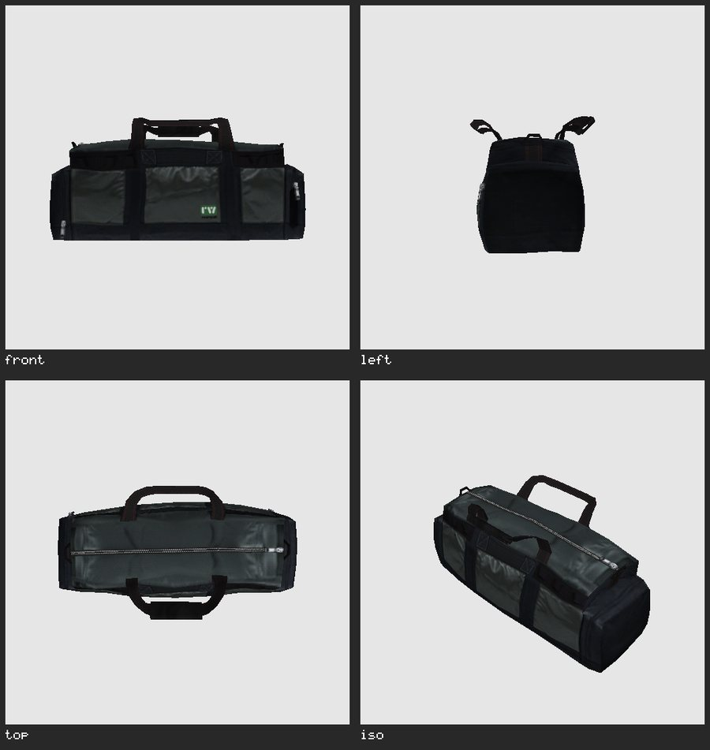

The binary is `rage`. It was called `rpf` until 0.16; see [Upgrading from
rpf-cli](#upgrading-from-rpf-cli).

## Contents

- [The toolchain](#the-toolchain)
- [Install](#install)
- [Quick start](#quick-start)
- [Concepts](#concepts)
- [Commands](#commands)
- [Samples](#samples)
- [Recipes](#recipes)
- [Configuration](#configuration)
- [Architecture](#architecture)
- [Releasing](#releasing)
- [Upgrading from rpf-cli](#upgrading-from-rpf-cli)
- [Acknowledgements](#acknowledgements)

## The toolchain

`rage` is thin: dispatch, argument parsing and the odd workflow. Everything
that understands a file format lives in three library crates, which anyone
can use on their own.

```
                 +-----------------------------------------------+
                 |  rage-cli   (this repo, binary `rage`)         |
                 |  commands, game index, navmesh generator       |
                 +-------+------------------+-------------------+-+
                         |                  |                   |
       +-----------------v---+   +----------v-----------+   +---v----------------+
       | rpf-archive         |   | rage-formats         |   | rage-render        |
       | RPF0..RPF8 and IMG  |   | RSC7 resources:      |   | CPU rasteriser,    |
       | archives, NG/AES    |   | ytd ydr ydd yft ymt  |   | contact sheets,    |
       | keys, RPF writer,   |   | ytyp ymap ybn ynv ynd|   | bitmap font,       |
       | DLC load order      |   | read, write, XML     |   | wasm glTF export   |
       +---------------------+   +----------+-----------+   +--------------------+
                                            ^                        |
                                            +------------------------+
```

| Crate | Repo | Owns |
|---|---|---|
| `rpf-archive` | [VIRUXE/rpf-archive-rs](https://github.com/VIRUXE/rpf-archive-rs) | getting bytes in and out of `.rpf`/`.img` archives |
| `rage-formats` | [VIRUXE/rage-formats](https://github.com/VIRUXE/rage-formats) | turning those bytes into structs, and structs back into bytes |
| `rage-render` | [VIRUXE/rage-render](https://github.com/VIRUXE/rage-render) | drawing what `rage-formats` parsed |
| `rage-cli` | this repo | the commands people run |

A sibling project, [fivem-mcp](https://github.com/VIRUXE/fivem-mcp), drives a
running FiveM client from an AI agent; it is how the navmesh work below gets
verified in game.

## Install

Prebuilt Windows and Linux binaries are attached to every
[release](https://github.com/VIRUXE/rage-cli/releases). Or build from source:

```sh
cargo install --git https://github.com/VIRUXE/rage-cli
```

Already installed? `rage update install` replaces the binary in place with
the latest release; see [Updating](#updating).

Reading retail game archives needs keys from your own game install; see
[Keys](#keys). Unencrypted archives, such as FiveM resource packs, need no
setup at all.

## Quick start

Point the tool at the game once, then look around:

```sh
export GTAV_PATH="C:/Program Files (x86)/Steam/steamapps/common/Grand Theft Auto V"

rage search "$GTAV_PATH" "prop_cs_heist_bag*" -d       # where is it, across every archive
rage extract "$GTAV_PATH/x64c.rpf" "*/lev_des.rpf" -o ./nested
rage screenshot ./nested/levels/gta5/props/lev_des/lev_des.rpf prop_cs_heist_bag_01.ydr --views front,iso --grid
```

Three commands, one picture. The rest of this document is variations on that.

## Concepts

**Archives.** GTA V keeps its files in `.rpf` archives, and archives inside
archives: `x64c.rpf` holds `levels/gta5/props/lev_des/lev_des.rpf`, which
holds the props. `list` and `tree` see one archive's top level; `search`
descends through nesting in memory; `extract` writes nested archives out as
files so the other commands can open them. Retail archives are NG-encrypted;
FiveM resource archives usually are not.

**Resources.** Most files inside are RSC7 resources: a 16-byte header, then a
deflated body split into a system section and a graphics section, with
pointers between blocks. Textures (`.ytd`), models (`.ydr`, `.ydd`, `.yft`),
metadata (`.ytyp`, `.ymap`, `.ymt`), collision (`.ybn`), navmeshes (`.ynv`)
and path nodes (`.ynd`) are all RSC7. `resource info` shows the header and
what a file holds; `resource dump` writes a map, a model, a collision or a
path node file out as the XML
CodeWalker (and Sollumz) use, and `resource build` makes the game file again
from that XML, edited or not.

**Metadata.** Map data is self-describing: a `.ymap`, `.ytyp` or `.ymt`
carries the layout of its own structures inside the RSC7 body, and a
`_manifest.ymf` or `.pso` carries the same in the big-endian PSO container
(FiveM also accepts hand-written XML manifests). Names in them are JOAAT
hashes. `resource info` reads the map, type and manifest files by name;
`resource dump` writes any of them out whole as XML or JSON. Some 20,000 of
the game's own structure, member and enum names are built in, so a dump's
`itemType`s and fields read as `CVehicleModelColorIndices` and `modelName`
out of the box; `names harvest` (from the game's files) or `names fetch`
(from a public list, no game install needed) add the content names —
archetypes, maps, dictionaries — so those print rather than
`hash_XXXXXXXX`.

**Load order.** The game reads its base archives, then `update.rpf`, then
each DLC pack in the order `dlclist.xml` and the packs' `setup2.xml` decide.
Later wins. Commands that fetch something "from the game" (the game index,
`navmesh cell`) follow that order so they hand you what the game would use.

**Keys.** Retail archives need the AES key from your `GTA5.exe`; the NG keys
and tables are derived from it. `--exe` or `GTAV_PATH` names the executable,
and the result is cached per game build.

**The game index.** Some answers need the whole game: which dictionary holds
the textures a model references, which map places an interior, which file
holds a vanilla prop's model. Commands that need one of these scan the
archives the first time, in under a second on an SSD, and cache the result
under `~/.rage-cli/index`. Nothing has to be run by hand, and the cache is
rebuilt by itself when an archive changes.

**Navmesh cells.** Pathfinding runs on `.ynv` files, one per 150 m grid cell,
named `navmesh[X][Y].ynv` with X and Y the cell index times three. Interiors
have no navmesh of their own: their polygons live inside the cell, flagged
interior. A custom interior (MLO) ships none, so NPCs inside it walk on the
polygons of whatever stood there before.

**Path nodes.** Traffic and wandering pedestrians follow `.ynd` files, one
per 512 m grid cell, named `nodes<N>.ynd` with N = y × 32 + x over a 32×32
grid from (-8192, -8192). A cell holds nodes (position, street, five flag
bytes: junction, highway, tunnel, disabled, speed, special type), the links
leaving each node (lane counts each way, shortcut, length) and the
heightmaps of its junctions. `update.rpf` overrides most of the base game's
cells; Cayo Perico's cells carry 1024 added to N and stream in over the sea
cells they replace.

**Escrow.** FiveM asset escrow encrypts some stream files (`FXAP` header).
Those cannot be read by anything but the client; every command says so
rather than guessing.

## Commands

Global options work on every command: `--exe <PATH>` or `GTAV_PATH` for the
keys, `--keys <DIR>` for keys written out with `extract-keys`, `-v` for
debug logging, `--no-update-check` to skip the daily release check.

### Archives

| Command | Does |
|---|---|
| `info <archive>` | version, encryption, entry count, size |
| `list <archive> [pattern] [-d]` | one archive's top level, optionally filtered |
| `tree <archive> [--depth N]` | the same as a tree |
| `search <path> <pattern> \| --content \| --hex \| --hash` | find files by name, contents or JOAAT hash, descending into nested archives; `<path>` may be a directory, and `<pattern> <path>` works too |
| `extract <archive> [pattern]... -o DIR [--recursive]` | write files out, any number of exact paths or globs in one pass; `--recursive` descends into nested archives and gives resources a valid RSC7 header |
| `verify <archive>` | integrity check |
| `create <dir> -o FILE [--version 7] [--encryption none\|open\|ng]` | build an archive from a directory |
| `extract-keys --exe PATH -o DIR` | write the keys to disk for `--keys` |

### Resources and textures

| Command | Does |
|---|---|
| `resource info <file> [--archive RPF] [--json] [--limit N] [--names FILE]...` | header plus a summary: every texture of a `.ytd`; bounds, LODs, geometry and shaders of a drawable; name, flags, extents and entity table of a `.ymap`; archetypes and interiors of a `.ytyp`; dependencies of a `_manifest.ymf` (PSO, RBF or XML); a `.ydr` also its skeleton bones, lights and collision bound; nodes, links, junctions, streets and adjacent cells of a `.ynd` |
| `resource dump <file> [--archive RPF] [--json] [-o FILE] [--names FILE]...` | any Meta or PSO file (`.ymap` `.ytyp` `.ymt` `.ymf` `.pso`) as XML in CodeWalker's layout, or as JSON |
| `resource dump <file.ydr\|file.ybn\|file.ynd> [--archive RPF] [-o FILE] [--no-dds]` | a drawable, a collision bound or a path node cell as CodeWalker's XML (`<Drawable>` / `<BoundsFile>` / `<NodeDictionary>`), its embedded textures saved as `.dds` beside `-o` (or in the current folder) unless `--no-dds`; XML only, no `--json` |
| `resource rename <file> <name> [--from NAME] [-o FILE] [--dry-run]` | change a name inside a file in place: a `.ymap`'s own name (the default), or any hash field or XML value equal to `--from`, in Meta, PSO and XML files |
| `resource build <file.xml\|file.json> -o FILE [--format meta\|pso] [--schema FILE]... [--strict] [--no-recalc] [--ytyp PATH]...` | the inverse of `dump`: a `.ymap`/`.ytyp`/`.ymt` (RSC7 Meta) or `_manifest.ymf`/`.pso` (PSO) from the XML or JSON, using CodeWalker's structure tables, or those of the original file with `--schema` |
| `resource build <file.xml> -o FILE.ydr\|FILE.ybn\|FILE.ynd [--textures DIR] [--strict]` | the inverse of the drawable/bound/path `dump`: a `.ydr` (version 165), `.ybn` (version 43) or `.ynd` (version 1) from CodeWalker's XML, textures read from `DIR` (default: the XML's folder); the written file is read back and must dump identically, or nothing is written; a texture that is not embedded or a bone without a name is a warning, an error with `--strict` |
| `resource recalc <ymap\|folder>... [--ytyp PATH]... [--dry-run] [--json]` | fix `.ymap` flags, `contentFlags` and extents in place, as `build` works them out; a folder is searched for every `.ymap`, and a file is rewritten only when something changed |
| `ytyp from-drawables <file\|dir>... -o FILE.ytyp [--txd NAME] [--lod-dist N] [--hd-dist N] [--flags N] [--merge FILE]` | a type file declaring an archetype for every `.ydr`, `.ydd` entry and `.yft`, with the bounds read from the model, as CodeWalker's "New Archetype from YDR" does; `--merge` adds to an existing `.ytyp` |
| `ymap from-menyoo <file.xml> -o FILE.ymap [--name NAME] [--lod-dist N] [--ytyp PATH]... [--no-recalc]` | a map from a Menyoo spooner XML, as CodeWalker's "Import Menyoo XML" makes it: props become entities, vehicles car generators, peds are left out; flags and extents worked out as `resource build` does |
| `ymap lodlights <ymap\|folder>... [-o DIR] [--name NAME] [--ytyp PATH]... [--models PATH]...` | the LOD lights of a resource's maps, as CodeWalker's project "LOD lights generator" writes them: every light of every placed model, hashed as the game hashes it, in `NAME_lodlights.ymap` and `NAME_distantlights.ymap` |
| `manifest generate <folder> [-o FILE] [--format pso\|xml]` | a resource's `_manifest.ymf` worked out from its `.ymap` and `.ytyp` files, as CodeWalker's project "Generate manifest" writes it: each map's type-file dependencies, interior flags, each interior's own dependencies and collision entry |
| `names harvest \| fetch \| info \| lookup <term>...` | the hash-to-name list: build it from the game (`--exe` required), download a public one (`--build N` says what it covers), see where it is and which game build it covers, or hash a name / name a hash |
| `textures <archive> <file> [-o DIR] [--format png\|jpg\|webp] [--sheet] [--max-size PX] [--dds]` | export a dictionary's textures, or the textures baked into a drawable, as images (alias `ytd`); a loose `.ytd`/`.ydr`/`.ydd`/`.yft` needs no archive |
| `textures encode <image\|dir\|glob>... [-o FILE\|DIR] [--format bc1\|bc3\|bc4\|bc5\|bc7\|rgba8] [--mips auto\|N]` | PNG/TGA/JPG/WebP/BMP to DDS with a full mip chain: BC5 for `*_n` normal maps, BC3 with alpha, BC1 otherwise |
| `textures build <dds\|image\|dir\|glob>... -o FILE.ytd [--from FILE.ytd] [--format ...] [--mips ...]` | a texture dictionary from DDS files (stored as they are) and images (encoded); `--from` adds to or replaces entries of an existing one |

### Rendering

| Command | Does |
|---|---|
| `screenshot <archive> <file> [--views ...] [--grid] [--ytd NAME]... [--paint #rrggbb] [--background ...] [--size WxH] [--lod ...] [--entry ...]` | render a `.ydr`/`.ydd`/`.yft` from up to six fixed angles, textures resolved from the file, `--ytd` and the index |
| `screenshot --vehicle NAME [--hi] [--livery N] [--colour-from carcols[:C]]` (also with `<archive> <file>`) | a vehicle by name through the index: its high-detail model, one of its liveries, its paint from carcols and carvariations |
| `screenshot --ped NAME [--component SLOT=D[:T[:A]]]...` | a ped composed from its variation info: the 12 component slots' default drawables and textures, or the ones named |
| `plot [<input>...] [--game --region x0,y0,x1,y1 [--detail D] [--max-lod LEVEL] [--hour H] [--weather W]] [--ymap|--ytyp|--ybn|--ydr FILE]... [--layers ...] [--floor-z Z|--z-range LO,HI] [--region ...] [--scale PX] [--marker x,y,label]... [--labels] [--props N|--no-props] [--title T] [--quality Q] -o FILE` | a top-down plan of an interior — rooms, portals, props, collision, drawable shell, navmesh and path nodes — of an exterior map, its entities drawn with their models — or, with `--game`, of a box of the vanilla map: every chunk the game streams there, LOD-filtered, with water and height contours — as PNG, JPG, WebP or SVG ||--ytyp\|--ybn\|--ydr FILE]... [--layers ...] [--floor-z Z\|--z-range LO,HI] [--region ...] [--scale PX] [--marker x,y,label]... [--labels] [--props N\|--no-props] [--title T] [--quality Q] -o FILE` | a top-down plan of an interior — rooms, portals, props, collision, drawable shell, navmesh and path nodes — or of an exterior map, its entities drawn with their models — as PNG, JPG, WebP or SVG |

### Navmeshes

| Command | Does |
|---|---|
| `navmesh info <file> [--archive RPF]` | cell, bounds, polygon/edge/portal/point counts, adjacent cells |
| `navmesh cell --at X,Y \| --index CX,CY -o FILE` | pull a cell out of the game, from the archive that loads last |
| `navmesh export <ynv> -o OBJ` | polygons as OBJ, grouped exterior/interior/sunk |
| `navmesh ybn-obj <ybn> [--ymap FILE] -o OBJ` | a collision file's triangles as OBJ, placed in the world by the ymap's MLO instance |
| `navmesh build <cell> --ybn FILE... --clip x0,y0,x1,y1 --floor-z Z -o FILE [...]` | generate interior polygons from collision and append them to the cell; see [Building a navmesh for an interior](#building-a-navmesh-for-an-interior) |
| `navmesh rewrite <ynv> -o FILE` | parse and write back unchanged; checks the writer against the game |

### Paths

| Command | Does |
|---|---|
| `paths info <file> [--archive RPF] [--names FILE]...` | cell, nodes by kind and flag, links inside and out of the cell, junctions, special types, streets, adjacent cells |
| `paths cell --at X,Y \| --index CX,CY \| --area N [-o FILE]` | pull a cell out of the game, from the archive that loads last |
| `paths export <ynd> -o OBJ` | nodes as points and links as lines, grouped by kind (road, ped, off-road, shortcut, disabled); junction heightmaps as meshes |
| `paths rewrite <ynd> -o FILE` | parse and write back unchanged; checks the writer against the game |

### Maintenance

| Command | Does |
|---|---|
| `update check \| install` | self-update from GitHub releases |

## Samples

One picture per kind of media `rage` writes, with the command that made it.
The interior is Gabz's cat cafe (a FiveM resource) over the navmesh built
in the recipe below; the props are vanilla.

| Media | Command | Sample |
|---|---|---|
| Interior plan, all layers (PNG) | `plot <resource folder> navmesh[108][96].ynv --marker ...` | [plot-catcafe.png](docs/images/plot-catcafe.png) |
| One storey with labels (SVG) | `plot ... --floor-z 21.25 --labels` | [plot-catcafe-floor.svg](docs/images/plot-catcafe-floor.svg) |
| Rooms, portals and navmesh only (WebP) | `plot ... --floor-z 21.25 --layers rooms,portals,navmesh --scale 20` | [plot-catcafe-rooms.webp](docs/images/plot-catcafe-rooms.webp) |
| Vanilla interior by name (JPEG) | `plot v_bahama --scale 20` | [plot-bahama.jpg](docs/images/plot-bahama.jpg) |
| A box of the vanilla map (JPEG) | `plot --game --region=-1700,-1200,-1100,-600 --scale 2` | [plot-region-docks.jpg](docs/images/plot-region-docks.jpg) |
| Model from several angles (JPEG grid) | `screenshot weapons.rpf w_ar_carbinerifle.ydr --views front,top,iso --grid` | [screenshot-carbinerifle-grid.jpg](docs/images/screenshot-carbinerifle-grid.jpg) |
| Model from one angle (WebP) | `screenshot weapons.rpf w_ar_carbinerifle.ydr --views iso --size 800x500 --format webp` | [screenshot-carbinerifle-iso.webp](docs/images/screenshot-carbinerifle-iso.webp) |
| Vehicle with wheels and paint (JPEG grid) | `screenshot vehicles.rpf adder.yft --views front,left,iso --grid --ytd adder --ytd vehshare --paint "#8b1a1a"` | [screenshot-adder-paint-grid.jpg](docs/images/screenshot-adder-paint-grid.jpg) |
| Translucent model on a transparent background (PNG) | `screenshot lev_des_mp_dlc.rpf hei_prop_pill_bag_01.ydr --views front --background transparent` | [screenshot-pill-bag-transparent.png](docs/images/screenshot-pill-bag-transparent.png) |
| One texture (PNG) | `textures weapons.rpf w_ar_carbinerifle.ytd --max-size 512` | [textures-carbinerifle-diffuse.png](docs/images/textures-carbinerifle-diffuse.png) |
| Texture dictionary contact sheet (JPEG) | `textures weapons.rpf w_ar_carbinerifle.ytd --sheet --max-size 256` | [textures-carbinerifle-sheet.jpg](docs/images/textures-carbinerifle-sheet.jpg) |
| Navmesh polygons (OBJ) | `navmesh export navmesh[108][96].ynv` | [navmesh-catcafe.obj](docs/samples/navmesh-catcafe.obj) |
| Placed collision (OBJ) | `navmesh ybn-obj denis3d_catcafe.ybn --ymap denis3d_catcafe_milo_.ymap` | [collision-catcafe.obj](docs/samples/collision-catcafe.obj) |

`screenshot`, `textures` and `plot` all take `--format png|jpg|webp` (`plot`
reads it off the `-o` extension, and adds `svg`); `--json` output and
`extract` are data, not media, so they are not pictured.

## Recipes

### Look inside an archive

```sh
rage info mp_biker_weed.rpf
rage tree mp_biker_weed.rpf
rage list mp_biker_weed.rpf "*bag*"
```

```
RPF Archive Information
======================
Entries:     70 (1 dirs, 69 files)
Encryption:  NG
Total size:  7375256 bytes (7.03 MB)

mp_biker_weed.rpf
├── _manifest.ymf (2.40 KB)
├── bkr_mp_biker_weed.ytyp (4.26 KB)
├── bkr_prop_fertiliser_pallet+hi.ytd (290.52 KB)
├── bkr_prop_fertiliser_pallet.ytd (110.82 KB)
├── bkr_prop_fertiliser_pallet_01a.ydr (134.05 KB)
├── bkr_prop_grow_lamp_02b+hidr.ytd (438.45 KB)
…
```


### Find anything, anywhere

`list` only sees one archive's top level. `search` descends into nested
`.rpf` entries in memory, and takes a directory to cover every archive under
it:

```sh
rage search "<GTA V>/x64c.rpf" "prop_cs_heist_bag*" -d    # which nested rpf holds it, with details
rage search "<GTA V>" "*.ymt" --json                       # every .ymt in the whole install
rage search "<GTA V>/x64a.rpf" --content binoculars -i     # bytes inside files (resources are inflated)
rage search "<GTA V>/x64b.rpf" --hex "52 53 43 37" --limit 5
rage search "<GTA V>/x64a.rpf" --hash 0x6D8A1F3C           # JOAAT of a name or stem
```

```
Path                                                                  Size   MemSize  Type      Hash
--------------------------------------------------------------------------------------------------------
<GTA V>/x64c.rpf:x64c.rpf/levels/gta5/props/lev_des/lev_des.rpf/prop_cs_heist_bag_01.ydr        170163  65536  Resource  0xE81D7506
<GTA V>/x64c.rpf:x64c.rpf/levels/gta5/props/lev_des/lev_des.rpf/prop_cs_heist_bag_02+hidr.ytd   548154   8192  Resource  0xA798254B
<GTA V>/x64c.rpf:x64c.rpf/levels/gta5/props/lev_des/lev_des.rpf/prop_cs_heist_bag_02.ydr        192198  98304  Resource  0xD7A1647F
```

Hits print as `<archive>:<path/inside/nested.rpf/file>`, one per line, and
`--json` emits an array with the same fields plus the match offset:

```json
[
  {"archive":"<GTA V>/x64c.rpf","path":"x64c.rpf/levels/gta5/props/lev_des/lev_des.rpf/prop_paper_bag_small.ydr",
   "name":"prop_paper_bag_small.ydr","size":8193,"mem_size":24576,"kind":"resource",
   "hash":"0x167D347D","stem_hash":"0x947A8766","offset":null}
]
```

A pattern without wildcards is a substring match on the full path, so
`inner.rpf` returns the archive and everything under it. Filters combine with
AND, and the summary goes to stderr so stdout stays clean for piping. Square
brackets are glob syntax; to find `navmesh[108][96].ynv` use `--hash` on the
stem, or `navmesh cell`.

### Extract files and nested archives

```sh
rage extract resource.rpf -o ./out                       # everything
rage extract "<GTA V>/x64e.rpf" "*/vehicles.rpf" "*/weapons.rpf" -o ./nested   # two nested archives, as files
rage extract "<GTA V>/x64b.rpf" -o ./nested --recursive  # descend into every nested rpf, to loose files
rage extract "<GTA V>/update/update.rpf" -o ./meta \
    common/data/handling.meta common/data/levels/gta5/vehicles.meta "x64/data/car*.ymt"   # one pass
```

Retail `x64*.rpf` archives keep drawables inside nested RPFs, so a model has
to be extracted to disk before `textures` or `screenshot` can open it.
`search` tells you which nested archive holds it, and the extracted path
mirrors that archive's own folder layout (`./nested/levels/gta5/vehicles.rpf`
above).

### Render a model to an image

`screenshot` frames the model automatically and renders it from any of six
fixed angles (`front`, `back`, `left`, `right`, `top`, `iso`; a view named
twice is rendered once). `--grid` collects the views into one labelled image,
always on its own dark background so the labels stay legible whatever
`--background` the renders use:

```sh
rage screenshot ./nested/models/cdimages/weapons.rpf w_ar_carbinerifle.ydr --views front,top,iso --grid
```

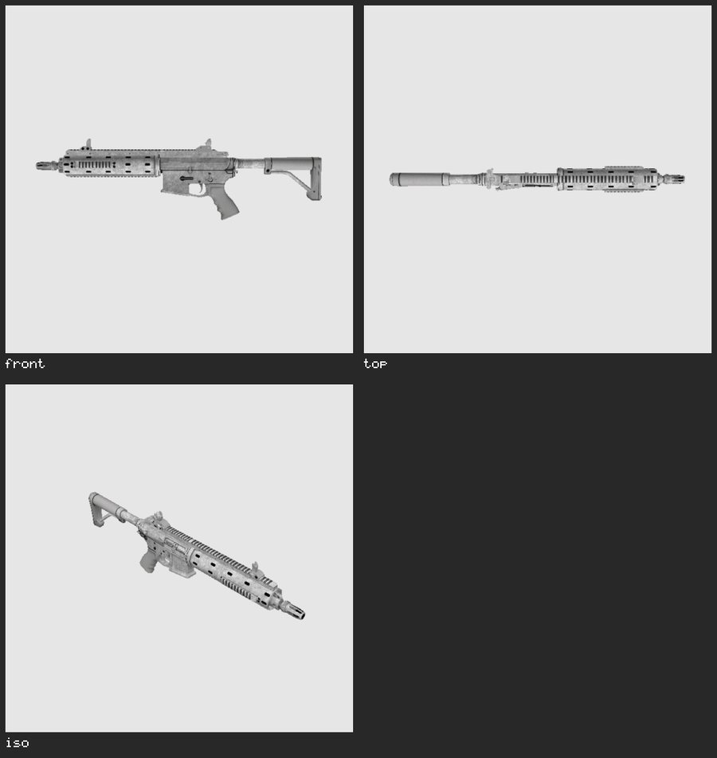

Without `--grid` every view is its own file, named after the model and the
view, and `--format` picks PNG, JPEG or WebP:

```sh
rage screenshot ./nested/models/cdimages/weapons.rpf w_ar_carbinerifle.ydr --views iso --size 800x500 --format webp
```

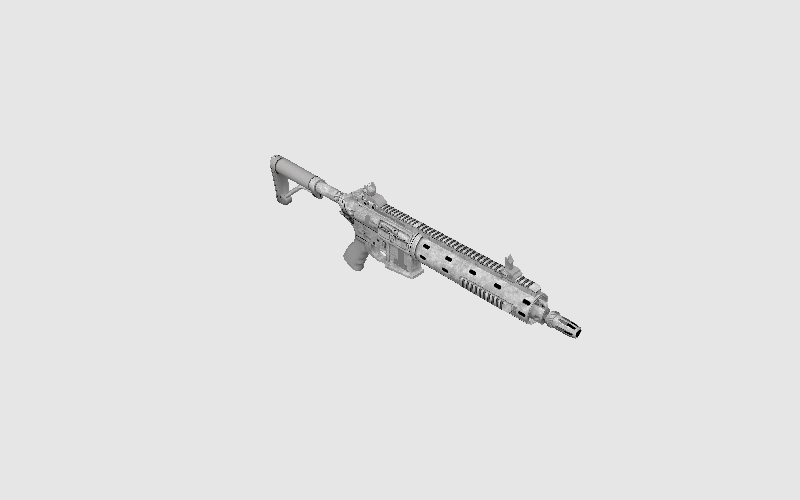

Textures a model references but does not carry come from `--ytd`,
repeatable, earlier ones winning, and after that from the index. A vehicle
takes its own dictionary plus the shared one:

```sh
rage screenshot ./nested/levels/gta5/vehicles.rpf adder.yft --views front,left,iso --grid --ytd adder --ytd vehshare
```

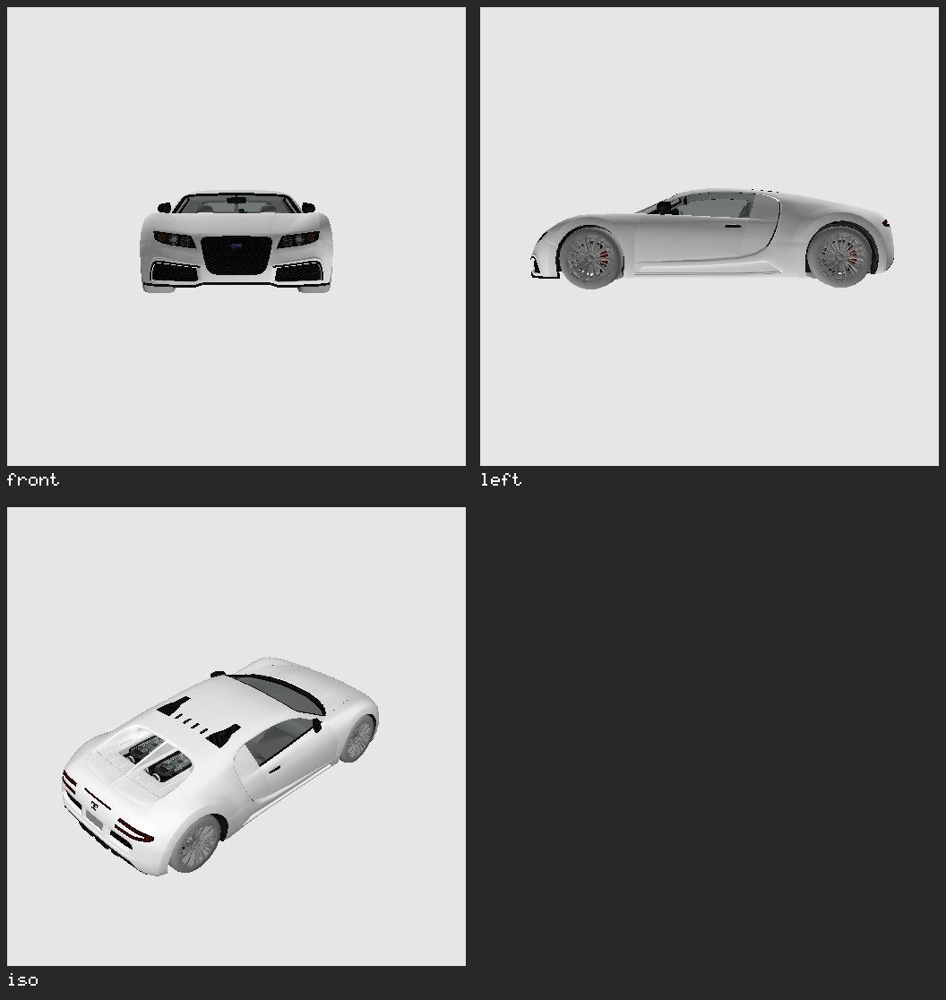

Textures a model asks for but nothing supplies are drawn flat grey and listed
by name, so the output itself tells you which `--ytd` to pass next.
Geometries whose shader names no diffuse texture at all (lights, glass) are
grey too, but counted apart as `N with no diffuse`: no dictionary will fill
those in.

A YFT is rendered as one piece: its main body, posed by the fragment's
default bone transforms, plus every physics child that carries a mesh,
placed by its physics transform. Vehicle wheels are the usual case. A YFT
typically ships one front and one rear wheel mesh; the other wheel slots
borrow those and right-hand wheels are mirrored, the same way CodeWalker
fills them in. The summary line counts the parts drawn, e.g. `5 parts (4
wheels)`. Damaged variants of a part are not drawn.

Vehicle bodies come out white because the paint colour is not in the YFT:
the game applies it at runtime from carcols metadata. `--paint #rrggbb`
tints every geometry drawn with a `vehicle_paint*` shader and leaves glass,
lights, tyres and interiors alone:

```sh
rage screenshot ./nested/levels/gta5/vehicles.rpf adder.yft --views front,left,iso --grid --ytd adder --ytd vehshare --paint "#8b1a1a"
```

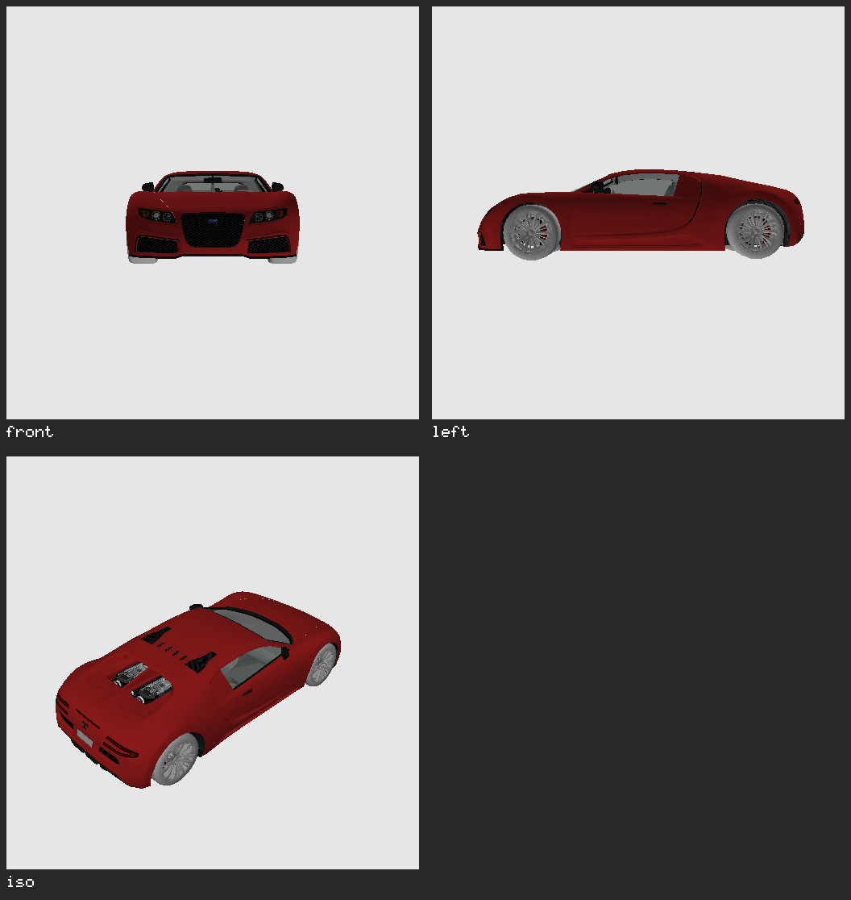

A model that is really several pieces scattered far apart (a prop set, a
building with its distant LOD) is framed on the piece with the bulk of the
geometry; `--no-cluster-framing` frames everything.

### Vehicle variants

`--vehicle NAME` finds a vehicle through the index instead of an archive
path, and the variant flags work with either form. `--hi` takes the
high-detail `NAME_hi.yft` when the game has one, as CodeWalker's vehicle
viewer does (falling back to the base model with a warning). `--livery N`
shows livery `N`, counted from 0 as the game counts them: every `*_sign_1`
texture the model references is read from `*_sign_<N+1>` instead, which is
how the game applies liveries — `police.yft` names `policenew_sign_1` and
`police.ytd` carries `policenew_sign_1` to `_6`. `--colour-from carcols`
paints the vehicle with the primary colour of its first spawn colour
combination in carvariations, looked up in carcols' colour list
(`carcols:C` picks combination `C`), and prints the colour's name:

```sh
rage screenshot --vehicle police --hi --livery 2 --colour-from carcols --views front,left,iso --grid
```

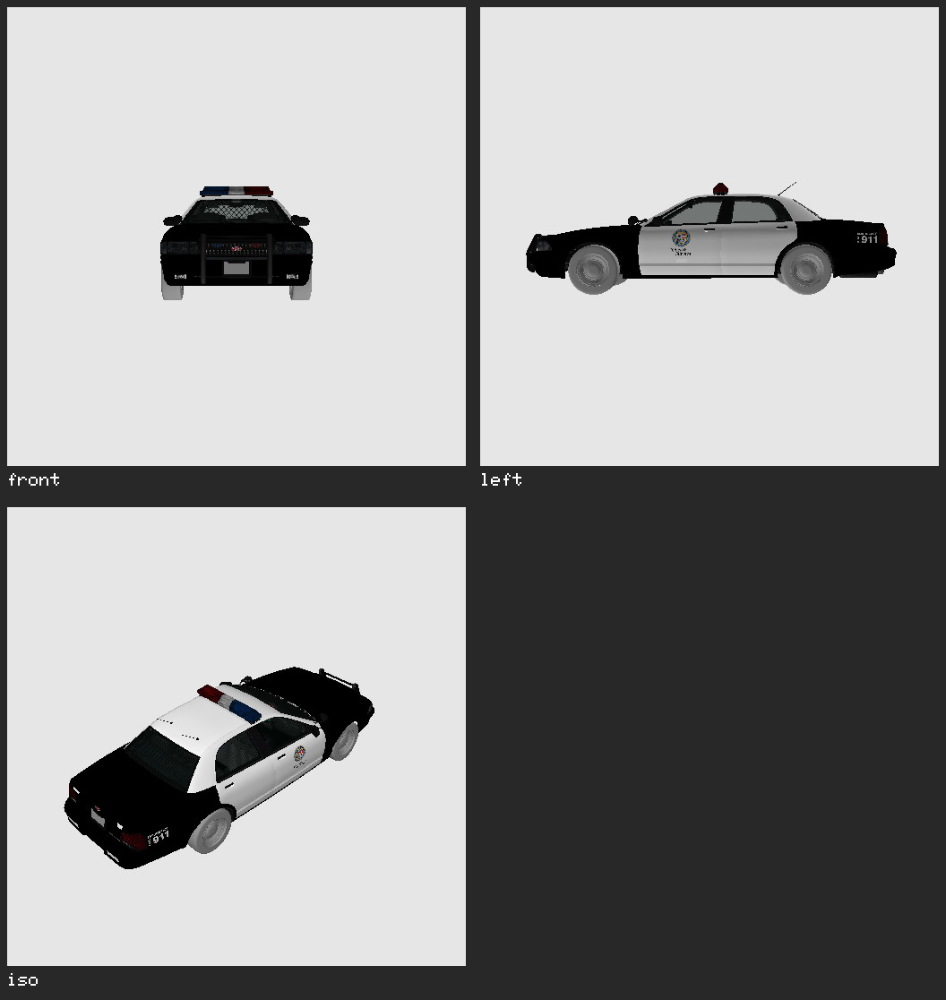

A livery the model's carvariations entry does not allow, or whose texture
the dictionaries do not hold, is reported and the model is rendered anyway.
Mod kits, secondary and pearlescent colours, plates and window tint are not
applied.

### Peds

`--ped NAME` composes a ped the way CodeWalker's ped viewer does: its
`.ymt` variation info names, for each of the 12 component slots (`head`,
`berd`, `hair`, `uppr`, `lowr`, `hand`, `feet`, `teef`, `accs`, `task`,
`decl`, `jbib`), a drawable in the ped's `.ydd` (`uppr_000_r`) and a
texture in its `.ytd` (`uppr_diff_000_a_whi`), or the streamed
per-component files in the ped's own folder; the texture replaces the
drawable's diffuse when it is drawn. Every slot takes its first drawable
and texture unless `--component` says otherwise: `SLOT=D[:T[:A]]` picks
drawable `D`, texture `T` and alternative `A`, `SLOT=none` leaves the slot
out. One line per slot says what was shown:

```sh
rage screenshot --ped a_m_y_acult_01 --views front,left,iso --grid
rage screenshot --ped a_m_y_acult_01 --component uppr=1:1 --component hair=none
```

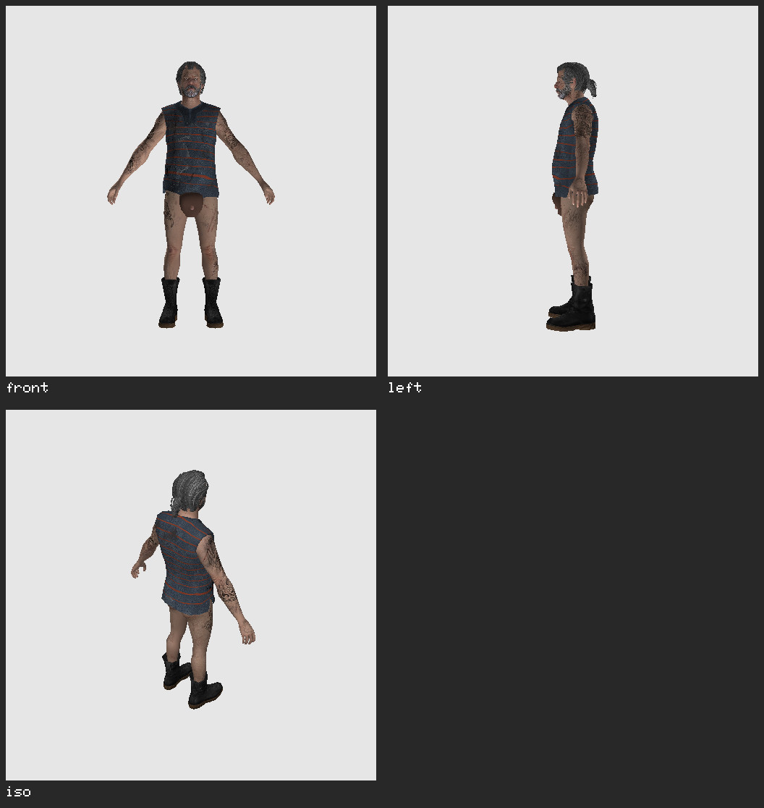

Props (hats, glasses), cloth and expressions are not drawn. Peds are
modelled facing the other way from vehicles, so they are turned to face
the `front` view.

### Transparent backgrounds and translucent materials

`--background` takes `grey` (default), `transparent`, or any `#rrggbb`. With
a PNG or WebP output the alpha channel is real, so the render drops straight
onto any page. Materials keep the blend mode the game gives them: cut-out
foliage is alpha-tested, and translucent plastic or glass is blended over
what sits behind it.

```sh
rage screenshot ./nested/lev_des_mp_dlc.rpf hei_prop_pill_bag_01.ydr --views front --background transparent
rage screenshot ./nested/mp_biker_weed.rpf bkr_prop_weed_lrg_01a.ydr --background transparent --ytd bkr_prop_weed
```

<p>
  
  
</p>

### Export textures as images

```sh
rage textures ./nested/models/cdimages/weapons.rpf w_ar_carbinerifle.ytd            # PNGs into ./w_ar_carbinerifle
rage textures ./nested/models/cdimages/weapons.rpf w_ar_carbinerifle.ytd --sheet --max-size 256 --format webp
rage textures ./nested/levels/gta5/props/lev_des/lev_des.rpf prop_cs_heist_bag_02.ydr   # textures baked into a drawable
```

Every texture in a dictionary lands in a folder named after it. `--sheet`
adds one labelled contact sheet of the lot, with a checkerboard behind
anything that has alpha:

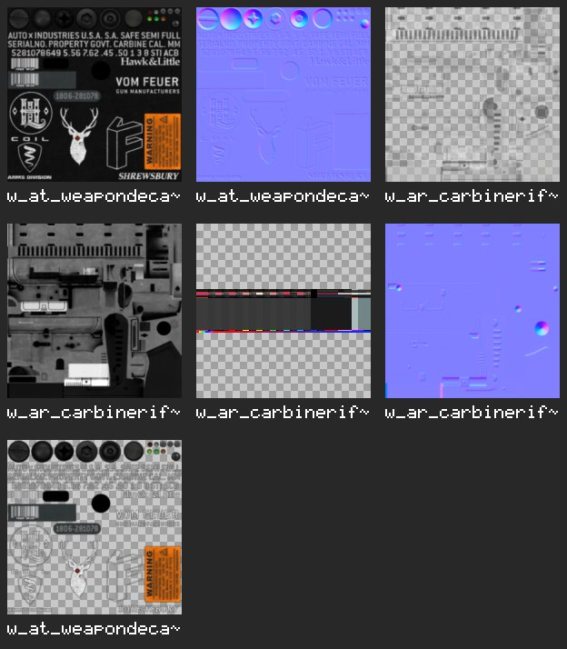

Each texture on its own is what the first command writes; the carbine's
diffuse map at `--max-size 512`:

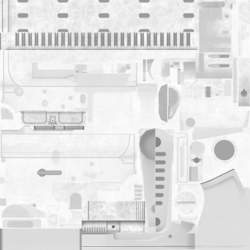

PNG is lossless and the best default. WebP output is lossless-only, JPEG
drops the alpha channel, and `--max-size` caps the longest edge so files stay
small. The old `ytd` command still works as an alias for `textures`, and
`--dds` restores its original raw-DDS output.

A loose resource on disk needs no archive: `rage ytd civic.ytd --dds`.

### Make textures and texture dictionaries

```sh
rage textures encode lights.png                          # lights.dds, BC1 or BC3 by alpha, mips down to 4x4
rage textures encode textures/ -o dds/ --format bc7      # a whole folder, one format
rage ytd build dds/ -o civic.ytd                         # a dictionary from DDS and image files
rage ytd build lights.png --from blista.ytd -o civic.ytd # start from a stock dictionary, add or replace by name
```

`encode` goes the other way from the export: an image becomes a DDS the
game can use, with every mip level down to 4x4 the way vanilla textures
ship (a single-level texture shimmers at distance). Without `--format` a
name ending in `_n` gets BC5 (two channels, what the game uses for normal
maps), anything with alpha gets BC3 and the rest BC1; `--format bc7` is the
best quality at BC3's size. Block formats need sizes that are multiples of 4.

`build` names each texture after its file stem, stores DDS inputs as they
are and encodes images with the same options as `encode`. `--from` starts
from an existing dictionary, so adding one texture to a copy of a stock
`.ytd` is one command. The result reads back with `textures`, `resource info`
and CodeWalker.

### Rebuild a resource file from XML or JSON

```sh
rage resource dump casas_praia_extras.ymap -o casas.xml     # edit casas.xml: fix <name>, move an entity...
rage resource build casas.xml -o casas_praia_extras.ymap    # and write the map back
rage resource dump _manifest.ymf --json -o manifest.json
rage resource build manifest.json -o _manifest.ymf
```

`build` is `dump` run backwards. It takes the XML (CodeWalker's layout) or
JSON that `dump` writes, edited or not, and produces the binary file: an
RSC7 Meta container for `.ymap`, `.ytyp` and `.ymt`, a PSO file for
`_manifest.ymf` and `.pso`. Names are hashed where the game stores a hash,
enum members and flag names are looked up, and a `hash_XXXXXXXX` left by a
dump that could not name something goes back in as that hash.

The structure definitions come from CodeWalker's tables, which cover the
map, type, manifest and most `.ymt` structures. For anything else, or to
keep exactly what a particular file declared, `--schema FILE` takes the
definitions from a binary Meta or PSO file (the file being rebuilt is the
natural choice, and an existing output file is used automatically). A
member the writer cannot fill is reported and left zero; `--strict` makes
that an error. The result is read back before it is written, so what comes
out is a file `dump` and CodeWalker agree on.

A `.ymap` gets its `flags`, `contentFlags` and both extents boxes worked
out from what it holds, the way CodeWalker does on save, so a moved entity
never leaves the map streaming somewhere else. Each archetype's box comes
from the `.ytyp` files of the resource the output lands in (the folder
with the `fxmanifest.lua`), or the ones `--ytyp` names, then from the game
(`--exe`/`GTAV_PATH`); interiors get the box CodeWalker computes from their
rooms. An archetype found nowhere counts as a point and is named in a
warning. The `SCRIPTED` and `Critical` bits are kept as given, and so are
the extents of a map of LOD lights (their positions live in the parent
map) or of an empty stub map. `--no-recalc` writes everything verbatim.
For an interior rotated inside CodeWalker the boxes come out tighter than
CodeWalker's, which applies that rotation twice; they still contain every
entity.

A map that is already built is fixed in place with `recalc`, one file or a
whole resource or map pack at once:

```sh
rage resource recalc "resources/[maps]" --dry-run   # what would change, per file
rage resource recalc "resources/[maps]"             # rewrite the maps that are stale
```

Each map's archetypes are looked up the way `build` looks them up, from the
resource the map is in, and the same notes and warnings come out, prefixed
with the file. A map whose round trip through the Meta writer would lose
anything (a structure with no schema, say) is reported and left alone.
`--json` lists each file's values before and after.

### Drawables and bounds from XML

```sh
rage resource dump prop_x.ydr -o prop_x.xml        # prop_x.xml, plus one .dds per embedded texture
rage resource build prop_x.xml -o prop_x.ydr       # textures read from the XML's folder (or --textures DIR)
rage resource dump collision.ybn -o collision.xml
rage resource build collision.xml -o collision.ybn
```

`resource info` on a `.ydr` also lists its skeleton (bone count), lights and
collision bound.

`build` warns of what CodeWalker accepts silently but the game may not: a
shader parameter naming a texture that is not embedded (the game then looks
it up in the archetype's texture dictionary) and a bone without a name.
`--strict` turns the warnings into an error, and nothing is written. Where
CodeWalker guesses, `build` stops with an error instead: an unknown bound
type, a vertex row shorter than its layout, a `CompositeTransform` that is not
16 numbers, a composite inside a composite, a `<DrawableModelsX>` list next to
a LOD list, a count too big for the file (65536 vertices in a geometry), or an
XML whose root does not match the output (`<Drawable>` for a `.ydr`,
`<BoundsFile>` or `<Bounds>` for a `.ybn`).

A dump→build cycle is not bit-exact for collision, exactly as CodeWalker's own
import is not: a build may move a bound's vertices by up to one quantum per
axis, and the drift can add up over repeated cycles; a `GeometryBVH`'s polygons
come back in the order its rebuilt BVH gives them. The read-back check
compares XML with no texture folder, so texture pixels are outside it. `dump`
names each `.dds` after its texture with path separators and `: * ? " < > |`
replaced by `_`, so a texture name never writes outside the folder. A corrupt
file is an error for `dump`; `info` then prints what the older parser reads.

### Declare archetypes for new models

```sh
rage ytyp from-drawables stream/ -o stream/my_props.ytyp
rage ytyp from-drawables new_chair.ydr -o stream/my_props.ytyp --merge stream/my_props.ytyp --lod-dist 150
```

A prop needs an archetype in some `.ytyp` before a map can place it.
`ytyp from-drawables` writes one per model, filled the way CodeWalker's
"New Archetype from YDR" fills it: the model's file name as the archetype
and asset name, its bounding box and sphere, `lodDist` and `hdTextureDist`
60 and `flags` 32 unless given. The texture dictionary is a `.ytd` named
like the model beside it, else the model's own name when it embeds its
textures, else none (`--txd` sets one for all). A `.ydr` with collision
built in names itself as physics dictionary. A `.ydd` gives one archetype
per drawable, pointing at the dictionary (and at a `.ybd` of the same
name, if there is one). A `.yft` gives one fragment archetype, and a
vehicle's `_hi.yft` is skipped next to its `.yft`. Escrow-encrypted
models are skipped with a warning. `--merge` keeps the archetypes of an
existing `.ytyp` and replaces those given again.

### Turn a Menyoo placement into a map

```sh
rage ymap from-menyoo bench_park.xml -o my_park/stream/bench_park.ymap
rage ymap from-menyoo bench_park.xml -o my_park/stream/bench_park.ymap --lod-dist 150
```

`ymap from-menyoo` reads a Menyoo spooner file and writes what CodeWalker's
"Import Menyoo XML" does. Each placed object becomes an entity at its
position and rotation, static (`flags` 32) unless Menyoo marked it dynamic,
with its texture variation as tint. Each vehicle becomes a car generator
facing the way it was placed, with random colours and its livery. Peds are
counted and left out: a map has nowhere to put them. Attached objects are
placed where Menyoo last saved them, unattached. An entity's `lodDist` is
Menyoo's, capped at 10000; Menyoo saves 16960 for most props, which makes
the map stream in from anywhere, so `--lod-dist` sets one for all. The
map's flags and extents are then worked out the way `resource build` does
(`--ytyp`, the resource folder's type files, then the game index;
`--no-recalc` keeps CodeWalker's starting values). The map is named after
the output file unless `--name` says otherwise.

### Light a map up at distance

```sh
rage ymap lodlights my_park/stream/                       # writes my_park/stream/my_park_lodlights.ymap and my_park_distantlights.ymap
rage ymap lodlights my_park/stream/park.ymap -o out/ --name park
```

A lamp placed in a map only shines while its entity is streamed in; past
its `lodDist` the game draws the LOD lights instead, and a custom map
has none until they are generated. `ymap lodlights` does what CodeWalker's
project window "LOD lights generator" does: it takes every entity of the
maps given, finds its archetype in the resource's `.ytyp` files (or the
ones `--ytyp` names, then the game's through the index), its model among
the resource's `.ydr`, `.ydd` and `.yft` files (or `--models`, then the
game's), and turns each light of the model into one LOD light, carried
into the world by its bone and the entity's placement. Each light gets
the hash the game computes for an entity's lights (from the entity's
world box and the light's index after the archetype's extensions), so the
LOD light goes out when the real one comes on. The lights are sorted by
that hash and written as two maps, as CodeWalker does: `NAME_lodlights`
(`CLODLight`: directions, falloffs, time flags, cone angles, coronas) and
its parent `NAME_distantlights` (`CDistantLODLight`: positions and
colours, category medium), with the flags and extents CodeWalker's
`CalcFlags` and `CalcExtents` give them. `NAME` is the resource folder's
name unless `--name` says otherwise, and the maps land beside the input
unless `-o` says otherwise. Street lights are not told apart (CodeWalker
leaves that unfinished too), so `numStreetLights` is 0. An entity whose
archetype or model is found nowhere is named in a warning and skipped; a
map with no light at all is an error, and nothing is written.

### Generate a resource's manifest

```sh
rage manifest generate my_mlo/                  # writes my_mlo/stream/_manifest.ymf
rage manifest generate my_mlo/ --format xml     # CodeWalker's XML on stdout, to read or edit
```

A map whose entities come from a custom `.ytyp`, or that places an
interior, needs a `_manifest.ymf` saying so, or the game may stream the map
before the types it uses. `manifest generate` reads every `.ymap` and
`.ytyp` under the folder and writes what CodeWalker's project window
generates, in the same order: for each map, the type files declaring its
entities', interiors' and grass batches' archetypes (flagged
`INTERIOR_DATA` when it places an interior); for each interior's type file,
the other type files its rooms and entity sets use; and for each interior,
its collision entry. An archetype is looked up in the folder's own type
files first, then in the game's through the index (`--exe` / `GTAV_PATH`),
so props from DLC resolve too. Where the game declares an archetype twice,
the one loaded last wins, as in the game; CodeWalker with DLC turned off
names the base-game file instead. Archetypes found nowhere are listed in a
warning. Escrow-encrypted files are skipped, and an existing manifest is
replaced.

### Inspect a resource file

```sh
rage resource info ./out/prop_my_thing.ydr                   # a loose file, e.g. one you just exported
rage resource info --archive "<GTA V>/x64a.rpf" binoculars.ytd
rage resource info ./out/prop_my_thing.ydr --json            # one JSON object for scripts
```

Prints the RSC7 header (version, system/graphics page flags and the sizes
they encode, whether the body is deflated or stored) and then what the file
holds: every texture of a `.ytd` in the same per-line format `textures`
uses, or, for a `.ydr`/`.ydd`/`.yft`, each drawable's bounds, LOD distances,
per-LOD model, geometry and triangle counts, the shader table with diffuse
texture names, and the embedded textures. Handy for checking an export
before it goes into a stream folder: a bad magic or a zero-triangle high LOD
shows up immediately.

### Pictures for vision models

Every image command writes ordinary picture files, so a vision model can
look at a model or texture the same way you do. A model does not need more
than roughly 1500 px on the longest edge, and `--json` output from `search`
gives it a path to act on. A typical loop that finds every bag prop in the
game, extracts the archives that hold them, and renders each one looks like
this:

```sh
rage search "<GTA V>" "*bag*.ydr" --json > bags.json
# extract each distinct nested archive from bags.json, then:
rage screenshot ./nested/.../mp_biker_weed.rpf bkr_prop_weed_bag_01a.ydr --size 512x512 --format jpg --ytd bkr_prop_weed
```

A full-install `*.ydr` search takes a couple of seconds and a single 512 px
render under two seconds, so a few hundred props take minutes.

### Drawable dictionaries and fragments

Entries in a `.ydd` mostly share one name, the file's own, so they are
reported and written out as `0x<hash>` instead, and that hash is what
`--entry` takes to pick one of them:

```sh
rage screenshot ./nested/some_dictionary.ydd --views front,iso        # every entry, named by hash
rage screenshot ./nested/some_dictionary.ydd --entry 0x<hash> --views front,iso
```

### Inspect a map

What does a `.ymap` place, what is it called, and where is it? `resource
info` answers from the file alone:

```sh
$ rage resource info resources/bomba_paleto_1/stream/bombaPALETO.ymap
File:      resources/bomba_paleto_1/stream/bombaPALETO.ymap
Format:    RSC7  version 2
...
Map:       bombaPALETO  parent -
Flags:     0x0   content 0x1 HD
Streaming: (-103.67, 6293.98, -169.29)..(462.04, 6832.73, 231.73)
Extents:   (162.11, 6559.76, 30.71)..(205.70, 6576.39, 31.73)
Entities:  5 (0 MLO instances)
     #  archetype                                 x          y        z     yaw scale    lod  flags
     0  prop_barier_conc_05b                197.263   6573.081   30.780   20.0°  1.00    200  0x20
     ...
```

The map's own name is the hash the game knows it by; it prints as text when
a file next to it, the built-in list or the harvested list has the name.
Archetype names come from the same places, so run `rage names harvest` once
(it scans the game's archives for every file stem and every XML name, about
ten seconds), or `rage names fetch` on a machine without the game (a public
list, current to the build you pass with `--build`), to have vanilla props
named. `--json` gives the whole entity list with positions, headings and
flags; `--limit 0` lists every entity in text.

An entity standing outside the map's stored extents is reported too: outside
the streaming box, the game never loads the map where that entity is (a
map edited by hand, or by a tool that does not recalculate). `resource
recalc` puts the boxes right; `--json` carries the counts as
`entities_outside_extents` and `entities_outside_streaming_extents`. Only
origins are checked, and the entities box spans the models, so an entity
whose model sits away from its origin can stay outside it after a recalc;
that one is a note, not a warning.

The game registers a map under its file name, while parent links and
manifest `imapName` entries use the name inside the file. A `.ymap` renamed
in the explorer keeps its old internal name, so nothing binds to it any
more and nothing looks wrong; `resource info` compares the two and says so:

```
Map:       hash_AEC13995  parent -
           warning: the file is called casas_praia_extras but the map calls itself hash_AEC13995 (0xAEC13995); the game registers it as casas_praia_extras,
           so parent links and _manifest.ymf imapName entries that say hash_AEC13995 will not bind (renamed outside CodeWalker?)
```

(`0xAEC13995` is `map1`, CodeWalker's default.) A manifest gets the
matching check: an `imapName` with no `.ymap` beside it is marked as a
vanilla map when some name list knows it, or as a likely leftover when
none does. Both are fixed in place, without CodeWalker:

```sh
rage resource rename stream/casas_praia_extras.ymap casas_praia_extras      # CMapData.name follows the file
rage resource rename stream/_manifest.ymf casas_praia_extras --from map1    # the manifest follows the map
```

`rename` rewrites only the hash fields the file's own schema says are
names (every one equal to `--from`, which for a `.ymap` defaults to the
map's own name), re-pages a Meta file into a fresh RSC7 container and
patches a PSO file in place; an XML manifest is edited as text.
`--dry-run` says what would change.

A manifest works the same way, whatever it was written in:

```sh
$ rage resource info resources/bomba_paleto_1/stream/_manifest.ymf
Format:    XML
Map dependencies (4):
  bombapaleto -> v_construction
  cs1_roads_pb_long_0 -> country_01_metadata_021_strm, v_sports, v_construction, ...
```

And any Meta or PSO file can be written out whole, in the XML layout
CodeWalker exports (so the two can be diffed) or as JSON:

```sh
rage resource dump stream/bombaPALETO.ymap -o bombaPALETO.ymap.xml
rage resource dump stream/_manifest.ymf --json
```

Hashes with no known name print as `hash_XXXXXXXX`, and the output ends
with how many there were and which game build the name list covers — a name
absent from a list older than the file is not proof the asset does not
exist. `rage names info` says the same about the list, `rage names lookup
0x18C49531` looks one hash up, `rage names lookup prop_barier_conc_05b`
hashes a name, and `--names FILE` adds a list of your own (one name per
line) to any of these commands.

### Plot an exterior map

A map that is not an interior — a shop front, a road block, a set of props
on the vanilla terrain — has no rooms or portals, only entities standing in
the world. `plot` draws each one where it is, labelled with its archetype,
and puts the prop's own model there when it can find one: a `.ydr`/`.ydd`
in the folder named after the archetype, or the game's own model through
the game index when `--exe`/`GTAV_PATH` is set.
An archetype with no model to hand is drawn as its bounding box (from a
`.ytyp` in the folder or the index), and failing that as its mark alone.

```sh
rage plot resources/bomba_paleto_1 --labels -o paleto.png
```

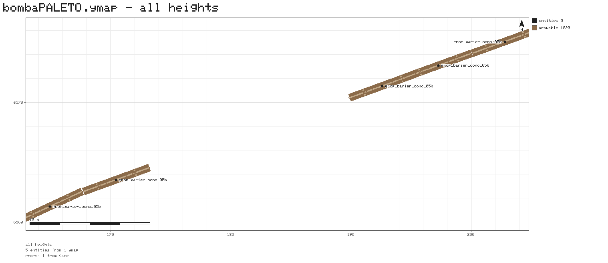

The caption says where the props came from (`props: 12 from game, 2 as
boxes, 1 unresolved`). `--props N` caps how many distinct models are read
(500 by default; the rest fall back to boxes) and `--no-props` keeps the
marks only, for a quick look at a big chunk. The page frames the entities;
vanilla chunks like `cs1_11.ymap` cover kilometres, so pair them with
`--region`.

The same corner of the map with its path nodes: `paths cell` fetches the
cell the game would load, and `plot` draws it (any `.ynd` on the command
line or in a folder joins the plan, in world space like a navmesh cell).
Roads are blue, pedestrian crossings magenta, nodes the game has disabled
red, shortcuts dashed grey; junction nodes get a ring, and a link's width
grows with its lane count.

```sh
rage paths cell --at=-250,6400 -o nodes911.ynd
rage plot nodes911.ynd --layers paths --scale 2 -o paleto-paths.png
```

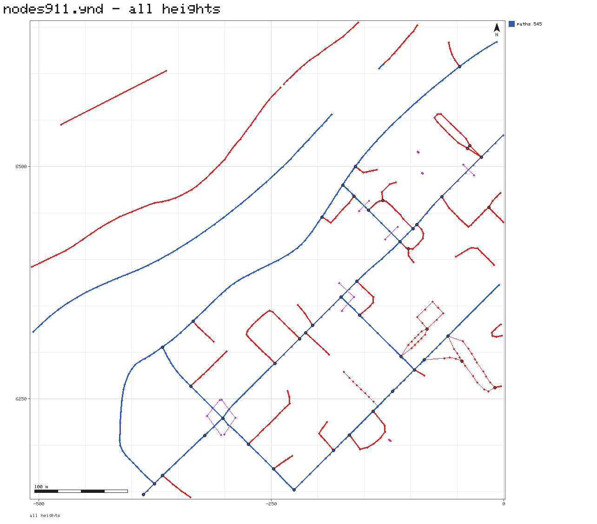

### Plot a box of the vanilla map

`--game` draws what the game itself streams over `--region`, read straight
out of the archives: the `cache_y.dat` map nodes whose extents meet the box
and their LOD parents, the maps a manifest switches off at an hour or
weather left out, and every entity linked into CodeWalker's LOD tree so that
the page shows what its map view shows at that zoom. The view distance is
the region's longer side, so a 600 m box is drawn from LOD and SLOD chunks;
`--detail 4` quarters it and brings the HD props in, `--max-lod lod` caps the
tree at a level, `--hour 22` and `--weather rain` apply the timed and
weather-gated map groups. Interiors placed in the box contribute their
entities, faded.

Two layers only the game can provide come on by default: `water`, the quads
of `water.xml` (dashed where the game marks them invisible), and `terrain`,
height contours from `heightmap.dat` at a round step named in the legend
(the max-height surface, so a tower rings like a hill). `navmesh` and
`paths` fetch the cells covering the box; `collision` (off by default: a
block is millions of triangles) reads the `.ybn` chunks the cache's bounds
store places there. Inputs and `--game` combine, so a resource folder can be
drawn over its vanilla surroundings.

```sh
rage plot --game --region=-1700,-1200,-1100,-600 -o docks.png
rage plot --game --region=-1400,-900,-1250,-750 --detail 8 --labels -o docks-hd.svg
rage plot --game --region=-1700,-1200,-1100,-600 --layers entities,water,terrain --no-props --scale 2 -o docks-terrain.png
```

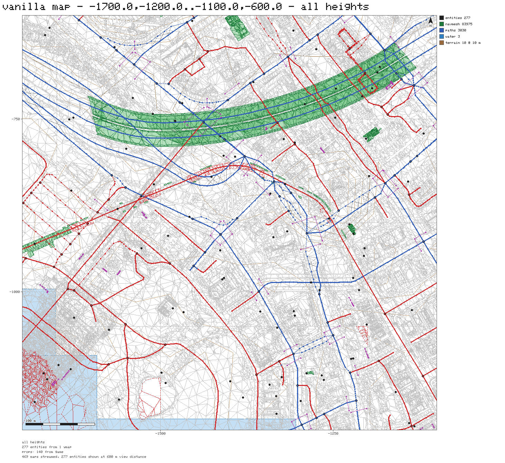

The caption counts the maps streamed and the entities shown at the view
distance. As in CodeWalker, a map and the DLC copy that replaces it
(`vb_rd` and `hei_vb_rd`) are both in the cache and both drawn; the first
run builds the `world` index part (see [The game index](#the-game-index)).

### Plot an interior

An MLO is a custom interior: one archetype standing in for a room layout,
portals, prop placements and its own collision, streamed in over a spot on
the vanilla map. `plot` draws it from above so you can check a build without
loading the game.

Point it at a resource folder and it sorts out what it's given:

```sh
rage plot resources/my_interior -o plan.svg
```

A cat cafe interior drawn from its resource folder together with the navmesh
cell built for it further down; every layer on, all storeys at once:

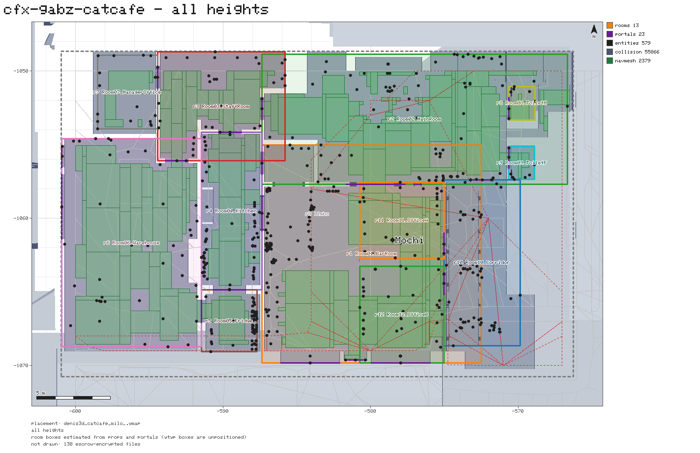

Loose files work the same way, either by extension or named explicitly when
the extension doesn't say enough:

```sh
rage plot interior.ytyp interior_milo_.ymap --ybn interior.ybn -o plan.svg
rage plot --ytyp interior.ytyp --ybn interior.ybn --ymap interior_milo_.ymap -o plan.svg
```

The collision goes behind `--ybn` rather than being listed positionally
because a mesh named there counts as the interior's own and is placed by the
`.ymap` whatever it is called; a mesh picked up any other way is only placed
when its name matches the archetype's, since the rest of what a resource
ships is vanilla map geometry that is already in world coordinates.

A vanilla MLO can be named directly, resolved through the game index
(`--exe`/`GTAV_PATH`, same as everything else that reads the game):

```sh
rage plot v_bahama -o plan.png
```

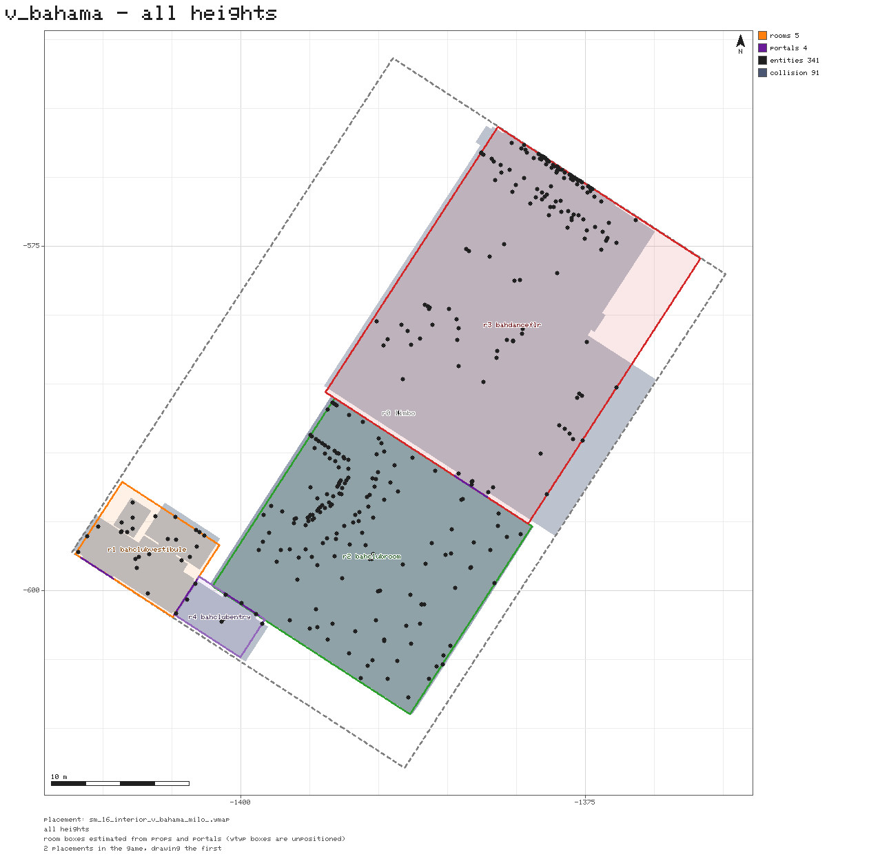

`--layers rooms,portals,entities,collision,drawable,navmesh,paths` picks what gets
drawn (the default is all of them); dropping `collision,drawable` on a big
interior is the quickest way to a readable page. A resource that stacks
several storeys in one MLO draws as an unreadable pile of overlapping rooms
by default; `plot` warns about it on stderr and names the rooms involved, and
`--floor-z Z` (one storey, `Z-0.3` to `Z+2.0` m) or `--z-range LO,HI` draws
just one.

The cat cafe's ground floor at `--floor-z 21.25 --labels`, as SVG:

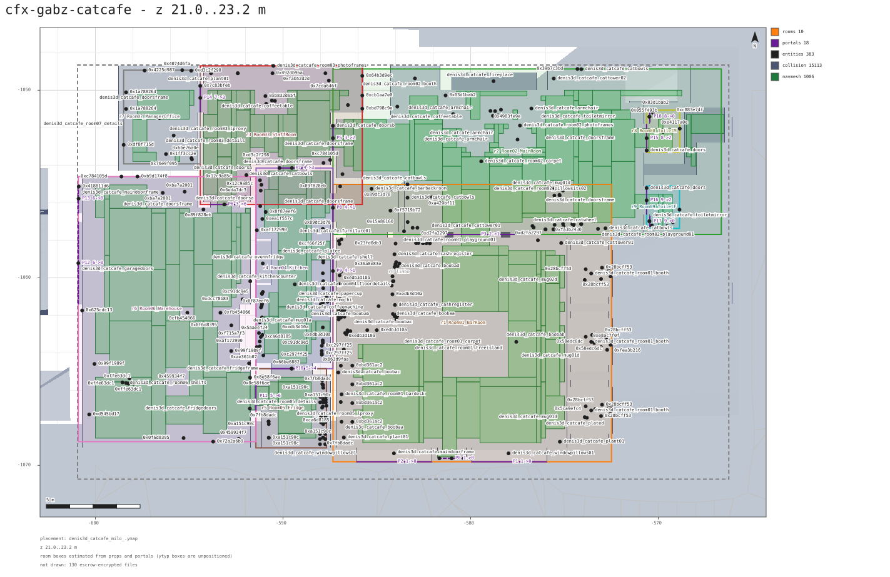

The same storey with `--layers rooms,portals,navmesh`, the quickest view
when checking where a navmesh leaks between rooms:

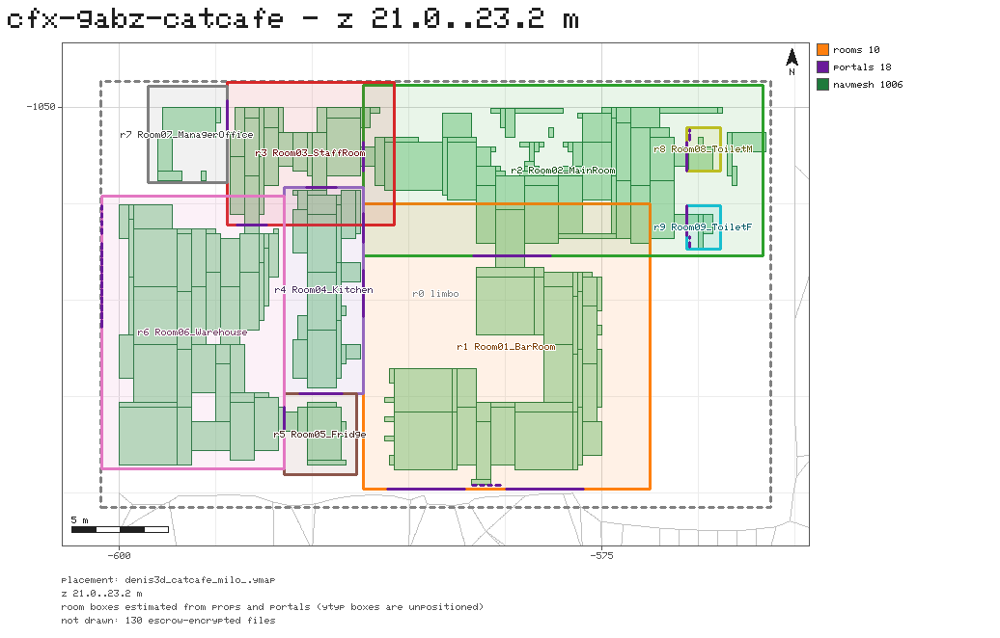

SVG keeps labels and lines crisp at any zoom, with the meshes rasterised into
one embedded image; PNG, JPG and WebP are for a quick screenshot to paste
somewhere. The extension on `-o` picks the format.

Only a mesh file named after the MLO's own archetype (an optional `hi@`,
`ma@` or `lo@` prefix is stripped first) is placed through the interior; any
other `.ybn`/`.ydr` sitting in the same folder is a vanilla map chunk and is
drawn as-is, in world space. A file named explicitly with `--ybn`/`--ydr` is
always taken as the interior's own, whatever its name says. Escrow-encrypted
files (FiveM's FXAP container) can't be read at all; `plot` skips them with
one line per folder on stderr and counts them in the page's caption rather
than failing.

Without a `.ymap` to place it, the plan stays in the interior's own
coordinates — useful for checking a layout in isolation, but not for lining
up with a navmesh cell or a marker in world space.

Some `.ytyp`s never record where a room actually sits: every box is stored
as half-extents around the MLO's own origin, which would stack every room on
top of the interior's centre if drawn as-is. `plot` notices and estimates
each room's footprint instead, from the props it owns and the portals that
open into it, and says so in the caption.

### Building a navmesh for an interior

The situation: a custom interior (a Gabz-style MLO) placed over a spot where
the vanilla map had something else. NPCs inside it path on the old cell's
polygons and walk into the new walls. Nothing generates a navmesh for an
MLO; the editing tools that exist have you draw polygons by hand. `rage`
generates them from the interior's collision.

Inputs, all from the MLO's `stream/` folder: the collision (`.ybn`), the
placement (`_milo_.ymap`, which says where the interior sits in the world),
and the type definitions (`.ytyp`, which list every prop the interior places
and each prop's bounding box). The `.ydr` models are usually escrow-encrypted
and not needed.

```sh
# 1. the vanilla cell under the interior
rage navmesh cell --at=-578,-1061 -o cell.ynv

# 2. where is the floor? export the placed collision and look, or histogram its upward faces
rage navmesh ybn-obj stream/ybn/interior.ybn --ymap stream/ymap/interior_milo_.ymap -o collision.obj

# 3. generate
rage navmesh build cell.ynv \
    --ybn stream/ybn/interior.ybn --ymap stream/ymap/interior_milo_.ymap \
    --ytyp stream/ytyp/interior_int.ytyp --ytyp stream/ytyp/interior_props.ytyp \
    --names-from stream/ydr --game-props \
    --clip=-600,-1070,-566,-1050 --floor-z 21.25 \
    -o "navmesh[108][96].ynv"

# 4. look before you ship
rage plot stream/ "navmesh[108][96].ynv" \
    --floor-z 21.25 --marker=-578.5,-1061.5,Mochi -o check.svg
```

Read the picture: rooms are coloured and named, portals to the outside are
dashed, the interior's own navmesh is green, sunk polygons (cut off from the
world when the interior swallowed them) are dashed red, and a grid, scale bar
and legend with per-layer counts sit around the plan so `21.25` and the
marker line up with what actually got built.
The plot from step 4 for the cat cafe is [docs/images/plot-catcafe.png](docs/images/plot-catcafe.png);
the OBJ files step 2 and `navmesh export` write for it are in
[docs/samples](docs/samples).

What `build` does, in order:

1. Rasterises the collision's walkable triangles (facing up, within
   `--floor-z` plus 0.6 m and minus 0.3 m) onto a grid of `--grid` metres.
2. Blocks every grid cell whose body slab (`--body`, 0.15 to 0.45 m above the
   floor) is crossed by any collision triangle, walls included.
3. Blocks the footprint of every prop the MLO places, using the archetype
   boxes from the `.ytyp` files and, with `--game-props`, from the index for
   vanilla props. A prop counts as furniture when it stands on the floor,
   rises above `--step-height` and has a footprint under `--max-prop-area`;
   room shells, light proxies, doors, windows and carpets are skipped by
   name fragment (`--ignore-entity` adds fragments, `--block-entity` forces a
   prop in). One line per prop is printed with the decision, and
   `--names-from` turns hashes into names for that report. Explicit
   `--block` rectangles do the rest.
4. Dilates blocked cells by one, merges free cells into rectangles no longer
   than `--max-side`, and splits every shared edge vertex for vertex: a GTA
   polygon edge names exactly one neighbour, so T-junctions are not
   representable.
5. Flags the new polygons interior and flat ground, links their adjacency,
   and appends them to the cell. Vanilla polygons under the interior are
   sunk to the cell floor and cut off from their neighbours rather than
   deleted, so every polygon index, and therefore every edge from the
   neighbouring cells, stays valid.

Drop the result in a resource's `stream/` folder; FiveM streams it over the
game's cell. If the interior straddles a cell boundary, build each cell with
its own `--clip` (the tool refuses a clip that leaves the cell).

Things learned the hard way:

- A block in an RSC7 file must never straddle a page: the game maps pages
  as separate allocations and relocates pointers per page. The writer packs
  16 KiB pages for that reason. `navmesh rewrite` on a vanilla cell is the
  regression test: it must load in game unchanged.
- Never restart or swap a streamed navmesh cell under a connected client
  standing in it. The client crashes, or hangs in a deflate loop. Restart
  with nobody nearby, or reconnect afterwards.
- Prop collision is usually inside the escrowed `.ydr`, invisible to the
  `.ybn` pass; that is what step 3 is for. A counter whose bounding box is
  tall (hanging fixtures are part of the model) will be skipped by the
  height rules, so check the report and force it with `--block-entity`.
- The first real test is a probe, not eyeballing: a tiny client resource
  that samples each NPC's position every half second and counts how often
  it is walking but not moving. Five to ten metres per 30 s with near-zero
  pushing samples is a working mesh.

## Configuration

| | |
|---|---|
| `GTAV_PATH` | the game folder or `GTA5.exe`; same as `--exe` |
| `RAGE_KEYS_CACHE` | where recovered keys are cached (default `~/.rage-cli/keys`) |
| `RAGE_NO_UPDATE_CHECK` | disable the daily release check (also `CI`) |
| `RAGE_UPDATE_CACHE` | where the update-check stamp lives |
| `RAGE_NAMES` | the harvested hash-to-name list (default `~/.rage-cli/names.txt`) |
| `~/.rage-cli/` | keys, index, names and update stamp; an existing `~/.rpf-cli` is used as is |
| `HTTP_PROXY`, `HTTPS_PROXY`, `NO_PROXY` | honoured by the update check and installer |

The `RPF_*` spellings of the variables still work.

### Keys

Retail archives are NG-encrypted, so reading them needs keys from your own
game install. Point the tool at the game once and forget about it:

```sh
export GTAV_PATH="<GTA V>"          # or the full path to GTA5.exe
rage list "<GTA V>/x64a.rpf" "*.ytd"
rage textures "<GTA V>/x64a.rpf" binoculars.ytd
```

`--exe <PATH>` does the same thing per-run and overrides the variable.
Either form takes the executable itself or the folder holding it.
Recovering the keys from the executable costs a couple of seconds, so the
result is cached per game build (keyed on the executable's size and
modification time); later runs load in milliseconds, and a game update
simply produces a new entry. An unwritable cache is not an error, the keys
are just recovered every time.

To manage a copy on disk yourself, write it out once and use `--keys`, which
takes precedence over `--exe`:

```sh
rage extract-keys --exe "<GTA V>/GTA5.exe" -o ./keys
rage list --keys ./keys "<GTA V>/x64a.rpf" "*.ytd"
```

Only the AES key is still stored as plain bytes in GTA5.exe. Newer builds no
longer carry the NG keys or decrypt tables, so those are unwrapped from a
`magic.dat` compiled into the binary, using the AES key found in your
executable. That `magic.dat` comes from CodeWalker, which generates it by
deflating the NG keys and decrypt tables, encrypting them with the AES key,
and masking the result with a seeded .NET PRNG stream. Unwrapping therefore
needs an AES key from a real game executable, so the keys stay inert without
one. The key material itself is the same across game versions; extracting
once is enough.

### The game index

The index lives under `~/.rage-cli/index/<game build>/` in six files, one
per part, and each command loads only the part it uses:

| Part | Holds | Used by |
|---|---|---|
| `textures.bin` | texture dictionaries by name, each archetype's dictionary, the parent chain, the resident dictionaries' textures | `screenshot` |
| `interiors.bin` | which `.ytyp` declares each interior, the `.ymap`s that place it, collision files by name | `plot <interior name>` |
| `models.bin` | model files by name, each archetype's box, model file and `.ytyp` | `plot` props, `navmesh build --game-props`, `resource build` extents, `manifest generate`, `screenshot --vehicle`/`--hi` |
| `peds.bin` | every ped `peds.ymt`/`peds.meta` lists, and where each one's `.ymt`, `.ydd`, `.ytd`, `.yft` and streamed component files are | `screenshot --ped` |
| `vehicles.bin` | every vehicle `vehicles.meta` lists, carcols' colour list and mod kits, each model's carvariations colour combinations and liveries | `screenshot --vehicle`, `--livery`, `--colour-from` |
| `world.bin` | every map node of the `cache_y.dat` files (parent, flags, extents), `.ymap`, `.ynv` and `.ynd` files by name, the caches' collision bounds, the manifests' timed and weather-gated map groups, where the heightmap and water files are | `plot --game` |

A missing part is built on first use. A part written for other archives,
after a game update or a mod, is rebuilt on the next use without being asked.
Archives are memory-mapped and read in parallel, so a build reads only the
tables of contents, the `.ytyp` files and a few small ones. Which maps place
an interior comes from the game's own world cache (`cache_y.dat`), so only
the maps it names as placing one, and the script-loaded maps it does not
describe, are opened: about 1,300 of 19,000. `--no-index` skips the index
for `screenshot` when the embedded and `--ytd` textures are enough.

`rage index info|build|clear` is hidden from the help, but still shows each
part's state, rebuilds all of them, or deletes them.

### Updating

```sh
rage update check     # ask GitHub whether a newer release exists
rage update install   # download it and replace this binary
```

`rage` also checks for a new release passively, at most once every 24 hours,
and prints a one-line note on stderr when one is found. It only runs when
stderr is a terminal, so it never fires in scripts or CI, and it never
delays a command: the check runs in the background and is reported after
your command has finished. `rage update install` downloads the release asset
for your platform along with its `SHA256SUMS`, verifies the checksum, and
replaces the running binary in place, including a binary installed with
`cargo install`. It refuses to install a release published without
checksums.

## Architecture

```
src/
  main.rs            clap definition and dispatch; one line per command
  commands/          one file per command; parse arguments, call the libraries, print
    navmesh.rs       the navmesh subcommands (cell lookup, OBJ/PNG output, build wiring)
    plot.rs          `plot`: placement, MLO-vs-world-space meshes, room-box estimation, exterior entities, the caption
    plot_game.rs     `plot --game`: the region's interiors, water, heightmap and navmesh/path/collision chunks through the index
    resource.rs      `resource info`/`dump`/`build`/`recalc`: container detection, per-format summaries, XML/JSON dumps, Meta/PSO rebuilds
    resource_drawable.rs  the drawable and bound side of `resource`: `.ydr`/`.ybn` dump to CodeWalker's XML, checked build, `info` extras
    names.rs         `names`: harvesting the game's names, lookups
    ymap.rs          `ymap from-menyoo`: a map from a Menyoo spooner XML, CodeWalker's import
    manifest.rs      `manifest generate`: a _manifest.ymf from a folder's maps and type files, CodeWalker's layout
  plot_inputs.rs     turning plot's free-form inputs (files, a resource folder, a vanilla name) into parsed sources
  region.rs          a box of the vanilla map assembled as CodeWalker streams it: cache map nodes, the LOD tree, the visible leaves
  props.rs           what to draw for a placed entity: a folder model, a game model through the index, a box, or nothing
  names.rs           the name table `resource` prints through: built-in, harvested, `--names`, sibling file stems
  navmesh/mod.rs     the generator: grid, blocking, rectangles, edge linking, sinking
  index.rs           the game index in five parts: build (archives in load order), per-part cache, lookups
  peds.rs            composing a ped from its variation info, as CodeWalker's ped viewer does
  vehicles.rs        vehicle variants: the _hi model, livery texture swaps, paint from carcols
  resources.rs       loading a resource by name from an archive or from disk
  keys.rs, paths.rs  key recovery/caching and the per-user directory
  update.rs          release check and self-update
  rpf.rs             a thin Archive wrapper over rpf-archive
tests/               integration tests that run the binary on hand-built fixtures; no game needed
```

Rules of thumb for changes:

- Parsing or writing a file format belongs in `rage-formats`, never here. A
  command should be able to read like a script.
- Anything that scans the whole game goes through `index::ranked_archives`
  so it sees archives in the game's own load order.
- Output that a person reads goes to stdout; progress and diagnostics go to
  stderr, so `--json` and OBJ/PNG outputs stay pipeable.
- A new command gets a `--help` that explains the domain, not just the flag,
  and a fixture test in `tests/`.

## Releasing

`rage-cli` depends on three published crates, `rpf-archive`, `rage-formats`
and `rage-render`, normally checked out as siblings. To build against the
checkouts without editing `Cargo.toml`:

```sh
cargo install --path . \
  --config 'patch.crates-io.rpf-archive.path="../rpf-archive-rs"' \
  --config 'patch.crates-io.rage-formats.path="../rage-formats"' \
  --config 'patch.crates-io.rage-render.path="../rage-render"'
```

To cut a release:

1. If a library change is needed, publish the crates to crates.io first, in
   dependency order (`rpf-archive`, `rage-formats`, `rage-render`), and bump
   the versions this crate pins.
2. Bump this crate's version in `Cargo.toml` and rebuild so `Cargo.lock`
   follows.
3. Commit, then `gh release create vX.Y.Z --notes ...`. The tag triggers the
   `release` workflow, which builds the Linux and Windows binaries,
   publishes a `SHA256SUMS` for them, and attaches all three to that
   release.

The asset names (`rage-linux-x86_64`, `rage-windows-x86_64.exe`) and the
`vX.Y.Z` tag shape are a contract with `rage update`; renaming either breaks
self-update for everyone already on an installed build. Publishing is a
manual, deliberate step; nothing here does it for you.

## Upgrading from rpf-cli

Version 0.16 renamed the project. What changed for you:

- The binary is `rage`. Same commands, same flags.
- The config directory is `~/.rage-cli`; an existing `~/.rpf-cli` keeps
  being used as is, so keys and index are not rebuilt.
- Environment variables are `RAGE_*`; the `RPF_*` spellings are still read.
- The library code moved out to `rpf-archive` (archives only),
  `rage-formats` and `rage-render`. If you depended on `rpf-archive` for
  parsers, import them from `rage-formats`.
- The installed `rpf` binary from an older release keeps working; it will
  update itself into `rage` on its next `update install`.

## Acknowledgements

- CodeWalker (<https://github.com/dexyfex/CodeWalker>), the reference for
  every byte layout in this toolchain, and whose `MetaNames` table is where
  the built-in list of the game's schema names was compiled from
- Swage (<https://github.com/0x1F9F1/Swage>)
- Contributors of <https://gtamods.com/wiki/RPF_archive>

## License

[Unlicense](LICENSE), public domain.
